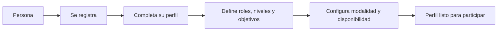
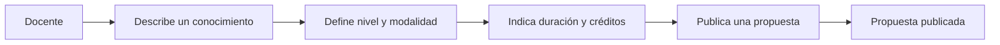
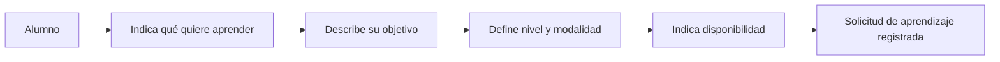
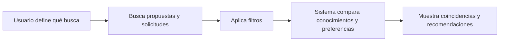
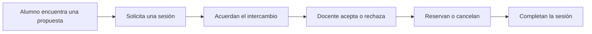
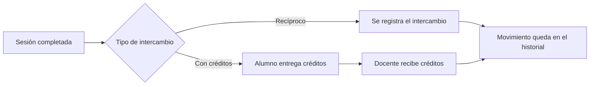
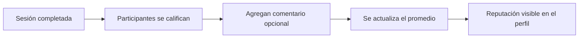
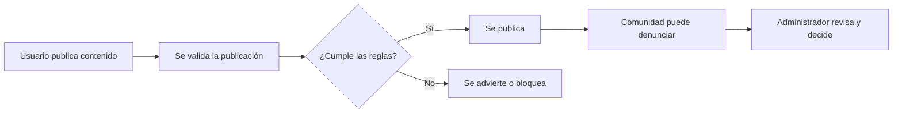

# Backlog del MVP

**Proyecto:** Plataforma de intercambio de aprendizajes  
**Versión:** 1.0 — derivada del MVP aprobado

Las historias se derivan exclusivamente de `docs/mvp.md`. No se asignan prioridades ni estimaciones porque el MVP no las define.

## Épica E1. Acceso y perfiles

### Introducción

Esta épica permite que una persona ingrese a la plataforma y configure la información necesaria para participar como Docente, Alumno o ambas cosas.

### Objetivo y valor

Construir una identidad básica y unas preferencias que permitan encontrar aprendizajes y personas compatibles.

### Alcance

Incluye registro, autenticación, perfil, roles, niveles, objetivos, modalidad y disponibilidad.

### Fuera de alcance

No incluye tipos de cuenta separados por rol ni integración con calendarios externos.

### Storytelling

### Resultado esperado

La persona puede acceder a la plataforma y mantener un perfil completo y editable.

### Trazabilidad

Conceptos principales; Perfiles de usuario; Disponibilidad horaria.

### HU-01 — Registrarse

#### Refinamiento informado por prácticas actuales

#### Refinamiento aplicado

- validar campos obligatorios y formato
- mostrar errores junto al campo correspondiente
- conservar los datos válidos después de un error
- evitar almacenar contraseñas en texto plano
- permitir contraseñas largas y no imponer combinaciones arbitrarias de caracteres.

#### Pendientes de decisión

- confirmación de correo
- longitud mínima
- aceptación de términos
- campos exactos del primer paso y política ante un correo ya registrado.

#### Recomendación de IA

- **Recomendación:**
  - usar correo
  - contraseña y aceptación de términos como campos del primer paso
  - exigir confirmación de correo antes de publicar
  - solicitar o transferir créditos
  - responder de forma genérica cuando el correo ya existe
  - aceptar contraseñas de al menos 12 caracteres sin reglas arbitrarias y limitar a 5 intentos fallidos por ventana de 15 minutos.
- **Motivo:**
  - reduce cuentas no verificadas
  - enumeración de usuarios y abuso automatizado sin degradar la accesibilidad.
- **Alternativas:**
  - confirmación obligatoria desde el registro
  - cuenta limitada hasta confirmar
  - confirmación opcional solo para acciones sensibles.
- **Impacto:**
  - requiere estado de verificación
  - token con vencimiento y controles de frecuencia.
- **Estado:**
  - pendiente de aprobación.

Como usuario, quiero registrarme para crear una cuenta y utilizar la plataforma.

- **Aceptación:** se completan los datos básicos y se crea la cuenta.
- **MVP:** Funcionalidades principales del MVP; Perfiles de usuario.

### HU-02 — Iniciar y cerrar sesión

#### Refinamiento informado por prácticas actuales

#### Refinamiento aplicado

- ofrecer mensajes de error claros sin revelar información sensible
- invalidar la sesión al cerrar sesión
- proteger los intentos repetidos y mantener una sesión segura en el navegador.

#### Pendientes de decisión

- duración de la sesión
- cierre de todas las sesiones
- recuperación de contraseña
- bloqueo temporal y autenticación multifactor.

#### Recomendación de IA

- **Recomendación:**
  - usar un mensaje único para credenciales inválidas
  - invalidar la sesión activa al cerrar sesión
  - aplicar 5 intentos fallidos por ventana de 15 minutos
  - usar una sesión de 30 minutos de inactividad y dejar recuperación de contraseña y MFA como flujos separados
  - el enlace de recuperación debería vencer en 15 minutos y ser de un solo uso.
- **Motivo:**
  - es una base actual de seguridad con bajo impacto funcional y evita bloqueos abusivos.
- **Alternativas:**
  - sesión persistente opt-in
  - cierre automático por inactividad
  - MFA obligatorio u opcional.
- **Impacto:**
  - requiere política de sesión
  - recuperación segura y registro de eventos relevantes.
- **Estado:**
  - pendiente de aprobación.

Como usuario, quiero iniciar y cerrar sesión para acceder a mis actividades y proteger mi cuenta.

- **Aceptación:** el usuario puede iniciar sesión con sus credenciales y cerrar la sesión activa.
- **MVP:** Funcionalidades principales del MVP.

### HU-03 — Completar el perfil

#### Refinamiento informado por prácticas actuales

#### Refinamiento aplicado

- permitir guardar parcialmente y editar el perfil
- distinguir campos obligatorios de opcionales
- mostrar una vista previa de la información visible para otros usuarios
- validar textos y límites de longitud.

#### Pendientes de decisión

- campos obligatorios
- visibilidad de ubicación
- posibilidad de ocultar el perfil y reglas para eliminar o cambiar información.

#### Recomendación de IA

- **Recomendación:**
  - hacer obligatorios el nombre visible y la ubicación general
  - dejar descripción
  - foto y datos complementarios como opcionales
  - no pedir dirección exacta
  - establecer la ubicación privada por defecto
  - permitir mostrar solo ciudad o zona y ofrecer una vista previa de lo que verá la comunidad.
- **Motivo:**
  - minimiza exposición de datos y reduce abandono durante el alta.
- **Alternativas:**
  - perfil público desde el inicio
  - ubicación aproximada obligatoria
  - perfil ocultable solo por administración.
- **Impacto:**
  - requiere permisos de visualización
  - estados de completitud y reglas de eliminación.
- **Estado:**
  - pendiente de aprobación.

Como usuario, quiero completar mi nombre, descripción y ubicación general para presentarme ante la comunidad.

- **Aceptación:** el perfil permite guardar esos datos y editarlos.
- **MVP:** Perfiles de usuario.

### HU-04 — Definir roles y preferencias

#### Refinamiento informado por prácticas actuales

#### Refinamiento aplicado

- permitir que una persona actúe como Docente y Alumno
- configurar nivel por tema
- conservar las preferencias al editarlas
- mostrar qué información falta para mejorar la compatibilidad.

#### Pendientes de decisión

- si se exige al menos un tema para enseñar o aprender
- valores permitidos para disponibilidad y si las preferencias pueden modificarse mientras existen solicitudes activas.

#### Recomendación de IA

- **Recomendación:**
  - permitir ambos roles
  - exigir al menos un tema y nivel por cada rol activo
  - representar disponibilidad con días de la semana
  - franjas horarias y zona horaria
  - permitir cambios mientras no haya una sesión confirmada y congelar las preferencias de los acuerdos existentes.
- **Motivo:**
  - mantiene flexible el perfil y evita que una edición posterior cambie acuerdos existentes.
- **Alternativas:**
  - exigir ambos perfiles completos al registrarse
  - congelar preferencias durante toda solicitud activa
  - recalcular siempre.
- **Impacto:**
  - requiere validar el contexto de la acción y definir cuándo se recalculan compatibilidades.
- **Estado:**
  - pendiente de aprobación.

Como usuario, quiero indicar mis roles, niveles, objetivos, modalidad y disponibilidad para encontrar aprendizajes compatibles.

- **Aceptación:** se pueden configurar Docente y Alumno, niveles por tema, modalidad y franjas horarias.
- **MVP:** Conceptos principales; Perfiles de usuario; Disponibilidad horaria.

## Épica E2. Propuestas de enseñanza

### Introducción

Esta épica permite que un Docente publique un conocimiento o habilidad para que otras personas puedan encontrarlo y solicitar una sesión individual.

### Objetivo y valor

Convertir los conocimientos ofrecidos por la comunidad en propuestas claras, comparables y utilizables dentro del MVP.

### Alcance

Incluye nombre, categoría, descripción, niveles, modalidad, duración, créditos y tipo de clase individual.

### Fuera de alcance

No incluye clases grupales ni equipos docentes.

### Storytelling

### Resultado esperado

Una propuesta publicada contiene la información necesaria para que un Alumno evalúe si desea solicitarla.

### Trazabilidad

Publicación de propuestas de enseñanza.

### HU-05 — Publicar una propuesta

#### Refinamiento informado por prácticas actuales

#### Refinamiento aplicado

- validar campos antes de publicar
- permitir guardar un borrador
- mostrar un resumen previo
- impedir publicar sin categoría
- modalidad
- nivel
- duración y créditos cuando sean obligatorios.

#### Pendientes de decisión

- moderación previa obligatoria
- límites de duración y créditos
- edición posterior a una solicitud y estados de borrador/publicada/oculta.

#### Recomendación de IA

- **Recomendación:**
  - incorporar estados `borrador`
  - `publicada` y `oculta`
  - exigir tema
  - descripción
  - modalidad
  - duración positiva y costo entero no negativo
  - como propuesta inicial
  - limitar la duración a 120 minutos y el costo a 1–10 créditos
  - permitir editar mientras no existan solicitudes aceptadas.
- **Motivo:**
  - hace visible el ciclo de vida y evita que cambios posteriores alteren acuerdos.
- **Alternativas:**
  - moderación previa para todo
  - publicación inmediata con denuncia posterior
  - bloquear toda edición tras publicar.
- **Impacto:**
  - requiere transiciones de estado y reglas de inmutabilidad.
- **Estado:**
  - pendiente de aprobación.

Como Docente, quiero publicar un conocimiento o habilidad para que otros usuarios puedan encontrarlo.

- **Aceptación:** la propuesta incluye nombre, categoría, descripción, niveles, modalidad, duración y créditos.
- **MVP:** Publicación de propuestas.

### HU-06 — Publicar una sesión individual

#### Refinamiento informado por prácticas actuales

#### Refinamiento aplicado

- validar que cada sesión tenga un solo Docente y un solo Alumno
- rechazar configuraciones grupales
- comunicar la restricción antes de guardar.

#### Pendientes de decisión

- si una propuesta puede tener múltiples horarios disponibles y si el Docente puede publicar varias propuestas sobre el mismo tema.

#### Recomendación de IA

- **Recomendación:**
  - permitir varios intervalos de disponibilidad dentro de una propuesta
  - permitir otra propuesta sobre el mismo tema solo si cambia modalidad
  - nivel o condiciones
  - impedir duplicados con el mismo tema
  - modalidad y contenido activo.
- **Motivo:**
  - mejora la flexibilidad sin degradar la calidad de búsqueda.
- **Alternativas:**
  - una propuesta por tema
  - una propuesta por cada horario
  - combinar todas las variantes en una única propuesta.
- **Impacto:**
  - afecta el modelo de disponibilidad
  - validación de duplicados y presentación.
- **Estado:**
  - pendiente de aprobación.

Como Docente, quiero indicar que mi propuesta es individual para mantener el alcance del MVP.

- **Aceptación:** la propuesta no permite configurar más de un Docente o Alumno en la misma sesión.
- **MVP:** Publicación de propuestas.

## Épica E3. Solicitudes de aprendizaje

### Introducción

Esta épica permite que un Alumno exprese qué desea aprender y con qué objetivo, sin limitarse a opciones predeterminadas.

### Objetivo y valor

Representar necesidades de aprendizaje reales para mejorar la búsqueda y la compatibilidad entre personas.

### Alcance

Incluye conocimiento buscado, objetivo libre, nivel, modalidad y disponibilidad.

### Storytelling

### Resultado esperado

El sistema dispone de una solicitud de aprendizaje suficientemente clara para buscar propuestas adecuadas.

### Trazabilidad

Descripción general; Perfiles de usuario; Disponibilidad horaria.

### HU-07 — Indicar qué aprender

#### Refinamiento informado por prácticas actuales

#### Refinamiento aplicado

- permitir objetivo libre y datos estructurados de apoyo
- permitir editar
- pausar o eliminar la solicitud
- mostrar un estado claro de la solicitud.

#### Pendientes de decisión

- si una persona puede tener varias solicitudes simultáneas
- cuándo una solicitud deja de estar activa y qué datos son obligatorios.

#### Recomendación de IA

- **Recomendación:**
  - permitir hasta tres solicitudes activas por usuario
  - impedir duplicados para la misma combinación de tema y contraparte
  - exigir objetivo
  - nivel
  - modalidad y disponibilidad
  - definir estados `activa`
  - `pausada`
  - `cancelada`
  - `rechazada` y `completada`
  - con vencimiento sugerido a los 30 días sin actividad.
- **Motivo:**
  - refleja necesidades reales de aprendizaje y evita solicitudes ambiguas o abandonadas.
- **Alternativas:**
  - una única solicitud activa por usuario
  - límite configurable
  - vencimiento automático por inactividad.
- **Impacto:**
  - requiere reglas de unicidad
  - estado y visualización de solicitudes.
- **Estado:**
  - pendiente de aprobación.

Como Alumno, quiero indicar qué conocimiento deseo aprender para encontrar propuestas adecuadas.

- **Aceptación:** la solicitud permite describir el objetivo libremente, indicar nivel, modalidad y disponibilidad.
- **MVP:** Descripción general; Perfiles de usuario; Disponibilidad horaria.

## Épica E4. Búsqueda y compatibilidad

### Introducción

Esta épica ayuda a las personas a encontrar propuestas, solicitudes y usuarios compatibles según sus conocimientos y objetivos.

### Objetivo y valor

Reducir el esfuerzo de encontrar oportunidades relevantes y favorecer los intercambios recíprocos.

### Alcance

Incluye búsqueda, filtros, compatibilidad basada en reglas y recomendaciones.

### Fuera de alcance

No agrega criterios de compatibilidad que no estén definidos en el MVP.

### Storytelling

### Resultado esperado

Los resultados muestran oportunidades y personas compatibles con información suficiente para decidir el siguiente paso.

### Trazabilidad

Sistema de compatibilidad; Búsqueda y filtros; Descripción general.

### HU-08 — Buscar propuestas y solicitudes

#### Refinamiento informado por prácticas actuales

#### Refinamiento aplicado

- mostrar estado vacío cuando no existan resultados
- permitir consultar resultados en páginas
- presentar información suficiente para distinguir una propuesta de una solicitud.

#### Pendientes de decisión

- orden por relevancia
- fecha o compatibilidad
- búsqueda parcial y comportamiento ante errores del servicio.

#### Recomendación de IA

- **Recomendación:**
  - ofrecer estados de carga
  - vacío y error
  - paginar de 20 resultados
  - permitir búsqueda por coincidencia parcial en título
  - tema y descripción
  - ordenar por compatibilidad y usar fecha como desempate
  - mostrar por qué aparece cada resultado y marcar los datos faltantes.
- **Motivo:**
  - mejora comprensión y resiliencia sin agregar una capacidad de búsqueda no aprobada.
- **Alternativas:**
  - relevancia fija
  - orden por fecha
  - búsqueda semántica como evolución posterior.
- **Impacto:**
  - requiere contrato de resultados
  - paginación y manejo explícito de errores.
- **Estado:**
  - pendiente de aprobación.

Como usuario, quiero buscar conocimientos, propuestas y solicitudes para encontrar oportunidades relevantes.

- **Aceptación:** se muestran resultados relacionados con el conocimiento o habilidad buscada.
- **MVP:** Búsqueda y filtros.

### HU-09 — Aplicar filtros

#### Refinamiento informado por prácticas actuales

#### Refinamiento aplicado

- permitir combinar filtros
- mostrar filtros activos
- ofrecer limpiar uno o todos
- conservar los filtros al cambiar de página
- informar cuando la combinación no produce resultados.

#### Pendientes de decisión

- valores exactos de cada filtro
- si se puede filtrar por rangos de créditos y si los filtros se guardan entre sesiones.

#### Recomendación de IA

- **Recomendación:**
  - permitir combinar tema
  - nivel
  - modalidad
  - disponibilidad y costo
  - representar rangos de créditos con mínimo y máximo
  - mostrar cada filtro como etiqueta removible y ofrecer “limpiar todo”
  - no persistir filtros entre sesiones en el MVP.
- **Motivo:**
  - hace el estado visible y evita sorpresas al volver a buscar.
- **Alternativas:**
  - filtros mutuamente excluyentes
  - persistencia automática
  - guardar búsquedas como funcionalidad futura.
- **Impacto:**
  - requiere valores normalizados y estados de consulta reproducibles.
- **Estado:**
  - pendiente de aprobación.

Como usuario, quiero filtrar resultados por conocimiento, categoría, nivel, modalidad, ubicación, disponibilidad, intercambio y créditos.

- **Aceptación:** cada filtro puede aplicarse a los resultados y combinarse con otros.
- **MVP:** Búsqueda y filtros.

### HU-10 — Encontrar compatibilidades

#### Refinamiento informado por prácticas actuales

#### Refinamiento aplicado

- mostrar qué criterios generaron cada coincidencia
- diferenciar coincidencia parcial de coincidencia fuerte
- evitar presentar el resultado como garantía de éxito
- permitir revisar la información que sustenta la coincidencia.

#### Pendientes de decisión

- ponderación de criterios
- mínimo de compatibilidad
- desempate y tratamiento de datos faltantes.

#### Recomendación de IA

- **Recomendación:**
  - ponderar inicialmente tema 40%
  - nivel 25%
  - modalidad 15%
  - disponibilidad 15% y reputación 5%
  - exigir al menos coincidencia de tema y nivel para considerar compatibilidad
  - desempatar por disponibilidad y luego fecha
  - tratar datos faltantes como “sin evidencia”.
- **Motivo:**
  - permite validar el valor del algoritmo y detectar sesgos antes de sofisticarlo.
- **Alternativas:**
  - pesos configurables por usuario
  - modelo automático
  - no calcular puntaje y mostrar solo coincidencias.
- **Impacto:**
  - requiere definir criterios
  - desempates y mensajes explicativos.
- **Estado:**
  - pendiente de aprobación.

Como usuario, quiero encontrar personas compatibles según conocimientos, niveles, objetivos, modalidad y horarios.

- **Aceptación:** los resultados muestran coincidencias y la información principal de cada usuario.
- **MVP:** Sistema de compatibilidad.

### HU-11 — Recibir recomendaciones

#### Refinamiento informado por prácticas actuales

#### Refinamiento aplicado

- explicar por qué se recomienda una persona o propuesta
- permitir descartar una recomendación
- evitar repetir indefinidamente contenido descartado
- actualizar recomendaciones cuando cambien las preferencias.

#### Pendientes de decisión

- frecuencia de actualización
- cantidad de recomendaciones
- uso de IA/LLM y métricas para evaluar la calidad.

#### Recomendación de IA

- **Recomendación:**
  - mostrar hasta 10 recomendaciones
  - explicar al menos los dos factores principales
  - permitir descartarlas
  - no repetirlas durante 7 días y actualizar el conjunto después de cambios de preferencias
  - iniciar con reglas determinísticas y medir visualizaciones
  - descartes y solicitudes antes de incorporar un LLM.
- **Motivo:**
  - prioriza trazabilidad
  - control y evaluación sobre una automatización difícil de auditar.
- **Alternativas:**
  - recomendaciones manuales
  - modelo estadístico
  - LLM asistido con revisión y límites.
- **Impacto:**
  - requiere eventos de medición
  - actualización y criterios de calidad.
- **Estado:**
  - pendiente de aprobación.

Como usuario, quiero recibir recomendaciones de clases y personas compatibles según mis intereses y objetivos.

- **Aceptación:** las recomendaciones consideran objetivos libres, nivel, modalidad y disponibilidad.
- **MVP:** Descripción general; Sistema de compatibilidad.

## Épica E5. Intercambios y sesiones

### Introducción

Esta épica organiza el paso desde una propuesta encontrada hasta la realización y confirmación de una sesión de aprendizaje.

### Objetivo y valor

Permitir que Docentes y Alumnos coordinen intercambios claros, con estados y reglas visibles para ambas partes.

### Alcance

Incluye solicitud, tipo de intercambio, aceptación, rechazo, reserva, cancelación y confirmación de sesiones completadas.

### Fuera de alcance

No incluye sesiones grupales ni intercambios 2×1 u otras equivalencias no definidas.

### Storytelling

### Resultado esperado

Una sesión pasa por estados claros y, al completarse, queda disponible para historial, créditos y calificaciones.

### Trazabilidad

Solicitudes y reservas; Intercambios recíprocos y créditos virtuales; Disponibilidad horaria; Historial de actividades.

### HU-12 — Solicitar una sesión

#### Refinamiento informado por prácticas actuales

#### Refinamiento aplicado

- validar disponibilidad y datos obligatorios
- impedir solicitudes duplicadas para la misma propuesta y franja
- mostrar un resumen antes de enviar
- registrar el estado inicial como pendiente.

#### Pendientes de decisión

- conflictos con otras reservas
- modificación de una solicitud pendiente y vencimiento de solicitudes sin respuesta.

#### Recomendación de IA

- **Recomendación:**
  - mostrar y confirmar antes de enviar tema
  - contraparte
  - modalidad
  - horario
  - duración y créditos
  - bloquear conflictos con reservas existentes y duplicados activos
  - crear la solicitud en estado `pendiente` y vencerla sugerentemente a los 7 días sin respuesta.
- **Motivo:**
  - reduce errores de coordinación y evita solicitudes indefinidas.
- **Alternativas:**
  - permitir solicitudes superpuestas
  - vencimiento fijo
  - mantenerlas abiertas hasta cancelación manual.
- **Impacto:**
  - requiere validación transaccional
  - estados y notificaciones.
- **Estado:**
  - pendiente de aprobación.

Como Alumno, quiero solicitar una sesión desde una propuesta para comenzar el intercambio.

- **Aceptación:** la solicitud identifica participantes, tema, fecha, horario, duración, modalidad y tipo de intercambio.
- **MVP:** Solicitudes y reservas.

### HU-13 — Elegir el tipo de intercambio

#### Refinamiento informado por prácticas actuales

#### Refinamiento aplicado

- mostrar claramente las dos alternativas
- pedir confirmación del tipo elegido
- registrar el conocimiento ofrecido cuando sea recíproco y los créditos cuando corresponda
- impedir valores negativos o inconsistentes.

#### Pendientes de decisión

- si ambas partes deben confirmar
- si pueden cambiar el tipo después de aceptar y cómo se resuelven diferencias sobre el valor del intercambio.

#### Recomendación de IA

- **Recomendación:**
  - exigir confirmación explícita de ambas partes
  - mostrar tipo `intercambio` o `créditos` y su valor antes de confirmar
  - congelar esos datos al aceptar y registrar cualquier cambio posterior como una nueva propuesta.
- **Motivo:**
  - evita malentendidos y conserva evidencia del acuerdo.
- **Alternativas:**
  - confirmación de una sola parte
  - permitir cambios libres
  - resolver diferencias mediante administración.
- **Impacto:**
  - requiere versionado del acuerdo y estados de confirmación.
- **Estado:**
  - pendiente de aprobación.

Como Docente y Alumno, quiero acordar si el intercambio será recíproco o mediante créditos.

- **Aceptación:** se registra el tipo elegido y, si corresponde, el conocimiento ofrecido o la cantidad de créditos.
- **MVP:** Intercambios recíprocos y créditos virtuales.

### HU-14 — Gestionar una solicitud

#### Refinamiento informado por prácticas actuales

#### Refinamiento aplicado

- mostrar toda la información antes de aceptar o rechazar
- registrar quién y cuándo realizó la acción
- impedir aceptar una solicitud incompatible con la disponibilidad actual
- comunicar el cambio de estado.

#### Pendientes de decisión

- motivos obligatorios de rechazo
- vencimiento automático y posibilidad de volver a abrir una solicitud rechazada.

#### Recomendación de IA

- **Recomendación:**
  - ofrecer motivos `horario`
  - `modalidad`
  - `contenido`
  - `disponibilidad` y `otro`
  - exigir elegir uno y permitir una explicación de hasta 500 caracteres
  - notificar el cambio y no reabrir automáticamente una solicitud rechazada.
- **Motivo:**
  - mejora transparencia y evita reactivar acuerdos sin consentimiento.
- **Alternativas:**
  - rechazo sin motivo
  - reapertura por cualquiera
  - reapertura solo creando una nueva solicitud.
- **Impacto:**
  - requiere catálogo de motivos
  - auditoría y reglas de transición.
- **Estado:**
  - pendiente de aprobación.

Como Docente, quiero aceptar o rechazar una solicitud para confirmar si realizaré la sesión.

- **Aceptación:** la solicitud cambia a aceptada o rechazada y conserva su estado.
- **MVP:** Solicitudes y reservas.

### HU-15 — Reservar o cancelar

#### Refinamiento informado por prácticas actuales

#### Refinamiento aplicado

- controlar transiciones válidas de estado
- impedir cancelar una sesión ya completada
- pedir confirmación antes de cancelar
- conservar el historial de cambios.

#### Pendientes de decisión

- plazo máximo de cancelación
- modificación de horario
- motivo de cancelación
- penalizaciones y tratamiento de créditos cancelados.

#### Recomendación de IA

- **Recomendación:**
  - permitir cancelar solo desde estados `pendiente`
  - `aceptada` o `reservada`
  - pedir confirmación
  - registrar actor y motivo
  - sugerir un límite de 24 horas antes de la sesión para cancelar sin penalización
  - no revertir créditos ni aplicar penalizaciones sin una regla aprobada.
- **Motivo:**
  - protege a ambas partes y evita efectos económicos implícitos.
- **Alternativas:**
  - cancelación libre
  - ventana de cancelación
  - penalización automática.
- **Impacto:**
  - requiere reglas de cutoff
  - auditoría y tratamiento explícito de créditos.
- **Estado:**
  - pendiente de aprobación.

Como participante, quiero reservar, modificar o cancelar una sesión antes de realizarla.

- **Aceptación:** se aplican los estados y reglas de cancelación definidos por el MVP.
- **MVP:** Solicitudes y reservas; Disponibilidad horaria.

### HU-16 — Completar una sesión

#### Refinamiento informado por prácticas actuales

#### Refinamiento aplicado

- permitir completar solo una sesión aceptada y pasada
- registrar fecha y participante que la completó
- impedir completar dos veces la misma sesión
- habilitar historial y calificación después de completarla.

#### Pendientes de decisión

- si deben confirmar ambas partes
- cómo se gestionan disputas y cuánto tiempo se permite informar que una sesión no ocurrió.

#### Recomendación de IA

- **Recomendación:**
  - permitir completar solo una sesión `reservada` cuya fecha haya pasado
  - exigir confirmación de ambas partes
  - registrar quién y cuándo confirmó y abrir una ventana de 72 horas para informar que no ocurrió
  - no transferir créditos ni habilitar calificaciones antes del cierre.
- **Motivo:**
  - habilita créditos y calificaciones con evidencia mínima y reduce disputas tardías.
- **Alternativas:**
  - confirmación de una parte
  - confirmación de ambas
  - cierre automático por fecha.
- **Impacto:**
  - requiere estado de finalización
  - ventana de disputa y política de resolución.
- **Estado:**
  - pendiente de aprobación.

Como participante, quiero marcar la sesión como completada para registrar el resultado del encuentro.

- **Aceptación:** una sesión finalizada queda disponible para historial, créditos y calificación.
- **MVP:** Solicitudes y reservas; Historial de actividades.

## Épica E6. Créditos e historial

### Introducción

Esta épica registra el valor interno de los intercambios mediante créditos y conserva la actividad realizada por cada usuario.

### Objetivo y valor

Hacer transparente el movimiento de créditos y permitir que cada persona consulte su recorrido dentro de la plataforma.

### Alcance

Incluye transferencia de créditos al completar sesiones y consulta de sesiones, aprendizajes, intercambios y movimientos.

### Restricciones

Los créditos son internos de la plataforma y no son dinero ni pueden convertirse en dinero, productos o servicios.

### Storytelling

### Resultado esperado

Los créditos y las actividades quedan registrados de forma consultable para ambas partes.

### Trazabilidad

Intercambios recíprocos y créditos virtuales; Historial de actividades.

### HU-17 — Transferir créditos

#### Refinamiento informado por prácticas actuales

#### Refinamiento aplicado

- ejecutar la transferencia como una operación consistente
- impedir saldos negativos
- registrar origen
- destino
- cantidad
- sesión y fecha
- evitar transferencias duplicadas.

- #### Reglas vigentes

- los créditos son internos de la plataforma y no son dinero ni pueden convertirse en dinero
- productos o servicios.

#### Pendientes de decisión

- saldo inicial
- límites
- reversión por cancelación o disputa y reglas para cuentas suspendidas.

#### Recomendación de IA

- **Recomendación:**
  - implementar créditos como un libro de movimientos atómico e idempotente
  - acreditar exactamente el valor pactado una sola vez al completar
  - impedir saldos negativos
  - conservar fecha
  - origen
  - destino
  - motivo y referencia de sesión
  - revertir solo mediante un movimiento compensatorio
  - mantener explícitamente que no son dinero.
- **Motivo:**
  - evita duplicaciones y hace auditable el saldo.
- **Alternativas:**
  - almacenar solo el saldo actual
  - permitir saldo negativo
  - ajustar manualmente sin movimiento compensatorio.
- **Impacto:**
  - requiere transacciones
  - identificadores únicos y reglas de reversión.
- **Estado:**
  - pendiente de aprobación.

Como plataforma, quiero transferir créditos al Docente cuando una sesión mediante créditos se complete.

- **Aceptación:** el Alumno entrega los créditos, el Docente los recibe y el movimiento queda registrado.
- **MVP:** Intercambios recíprocos y créditos virtuales.

### HU-18 — Consultar historial

#### Refinamiento informado por prácticas actuales

#### Refinamiento aplicado

- separar sesiones
- aprendizajes
- intercambios y movimientos
- mostrar estados y fechas
- permitir consultar el detalle
- controlar el acceso para que cada usuario vea solo su información autorizada.

#### Pendientes de decisión

- filtros
- exportación
- paginación y tiempo de conservación del historial.

#### Recomendación de IA

- **Recomendación:**
  - separar sesiones
  - créditos y calificaciones
  - filtrar por tipo y rango de fechas
  - mostrar 20 registros por página con detalle de fecha
  - contraparte
  - estado y créditos
  - conservar el historial mientras la cuenta exista y no agregar exportación sin decisión de privacidad.
- **Motivo:**
  - mejora la comprensión del historial y limita la exposición de datos.
- **Alternativas:**
  - una línea de tiempo única
  - historial completo sin filtros
  - exportación desde el MVP.
- **Impacto:**
  - requiere categorías
  - permisos y política de conservación.
- **Estado:**
  - pendiente de aprobación.

Como usuario, quiero consultar mis sesiones, aprendizajes, intercambios y movimientos para hacer seguimiento de mi actividad.

- **Aceptación:** se muestran sesiones solicitadas, aceptadas, canceladas y completadas, además de créditos y temas.
- **MVP:** Historial de actividades.

## Épica E7. Calificaciones y reputación

### Introducción

Esta épica permite que las personas valoren sus experiencias de aprendizaje una vez finalizada la sesión.

### Objetivo y valor

Generar señales de confianza para ayudar a la comunidad a evaluar futuras propuestas y participantes.

### Alcance

Incluye puntuación de 1 a 5, comentario opcional y cálculo de la calificación promedio.

### Restricciones

Solo pueden calificarse participantes de una sesión marcada como completada.

### Storytelling

### Resultado esperado

Cada perfil puede mostrar una reputación basada en experiencias reales y completadas.

### Trazabilidad

Calificaciones y reputación; Historial de actividades.

### HU-19 — Calificar una experiencia

#### Refinamiento informado por prácticas actuales

#### Refinamiento aplicado

- habilitar la calificación solo después de completar
- permitir una puntuación de 1 a 5 y comentario opcional
- evitar calificaciones duplicadas
- mostrar el promedio y conservar la trazabilidad.

#### Pendientes de decisión

- plazo para calificar
- posibilidad de editar
- moderación de comentarios
- respuesta del calificado y tratamiento de calificaciones abusivas.

#### Recomendación de IA

- **Recomendación:**
  - permitir una calificación de 1 a 5 solo una vez por participante y sesión completada
  - hacer el comentario opcional con límite de 500 caracteres
  - permitir editar durante 48 horas
  - habilitar denuncia y ocultar provisionalmente solo tras revisión.
- **Motivo:**
  - vincula la reputación con una experiencia real y reduce abuso.
- **Alternativas:**
  - comentario obligatorio
  - calificación sin edición
  - moderación previa de todo comentario.
- **Impacto:**
  - requiere unicidad por sesión
  - ventana de edición y moderación.
- **Estado:**
  - pendiente de aprobación.

Como participante, quiero calificar a la otra persona después de completar una sesión para aportar información a la comunidad.

- **Aceptación:** solo se puede calificar una sesión completada, con puntuación de 1 a 5 y comentario opcional.
- **MVP:** Calificaciones y reputación.

## Épica E8. Seguridad y administración

### Introducción

Esta épica protege el carácter educativo, lícito y seguro de la plataforma y brinda herramientas básicas de revisión administrativa.

### Objetivo y valor

Prevenir contenidos inadecuados y permitir que las denuncias y sanciones sean revisadas por una persona administradora.

### Alcance

Incluye categorías permitidas, palabras prohibidas, validación, denuncias, advertencias, revisión, ocultamiento de publicaciones y suspensión o reactivación de cuentas.

### Restricciones

Las sanciones definitivas requieren revisión administrativa y la plataforma no permite ofrecer servicios profesionales.

### Storytelling

### Resultado esperado

La plataforma puede detectar, recibir, revisar y gestionar contenidos o cuentas que incumplan las reglas del MVP.

### Trazabilidad

Contenidos no permitidos y seguridad; Panel de administración.

### HU-20 — Validar y denunciar contenidos

#### Refinamiento informado por prácticas actuales

#### Refinamiento aplicado

- mostrar reglas antes de publicar
- validar categorías y expresiones prohibidas
- ofrecer motivos de denuncia claros
- confirmar la recepción de la denuncia sin revelar información innecesaria.

#### Pendientes de decisión

- lista exacta de categorías y expresiones
- revisión automática o manual inicial
- anonimato de la denuncia y límite contra denuncias abusivas.

#### Recomendación de IA

- **Recomendación:**
  - ofrecer categorías `acoso`
  - `fraude`
  - `contenido inapropiado`
  - `spam` y `otro`
  - pedir una descripción de hasta 1.000 caracteres
  - confirmar la recepción
  - limitar a 5 denuncias por usuario por día y mantener revisión humana para decisiones finales
  - no ocultar automáticamente por una sola denuncia.
- **Motivo:**
  - equilibra seguridad
  - debido proceso y prevención de denuncias maliciosas.
- **Alternativas:**
  - moderación automática
  - revisión manual total
  - denuncias anónimas.
- **Impacto:**
  - requiere cola de revisión
  - estados y registro de decisiones.
- **Estado:**
  - pendiente de aprobación.

Como plataforma, quiero validar publicaciones y permitir denuncias para limitar contenidos ilegales, riesgosos o ajenos al aprendizaje.

- **Aceptación:** se aplican categorías y expresiones prohibidas, se muestran advertencias y se pueden denunciar publicaciones o cuentas.
- **MVP:** Contenidos no permitidos y seguridad.

### HU-21 — Administrar denuncias y cuentas

#### Refinamiento informado por prácticas actuales

#### Refinamiento aplicado

- separar permisos administrativos
- registrar acciones y motivos
- mostrar el estado de cada denuncia
- permitir ocultar y restaurar publicaciones
- conservar un registro de suspensiones y reactivaciones.

- **Regla vigente:** las sanciones definitivas requieren revisión humana y no se aplican de manera automática.

#### Pendientes de decisión

- roles administrativos
- duración de suspensiones
- notificación al usuario
- apelaciones y retención del registro de auditoría.

#### Recomendación de IA

- **Recomendación:**
  - separar permisos de moderación y administración
  - registrar actor
  - fecha
  - motivo y objeto de cada acción
  - preferir ocultar o suspender de forma reversible por 7
  - 30 o 90 días
  - notificar el motivo y permitir una apelación dentro de 15 días.
- **Motivo:**
  - reduce errores irreversibles y permite auditar decisiones sensibles.
- **Alternativas:**
  - administrador único
  - sanciones permanentes
  - moderación sin apelación.
- **Impacto:**
  - requiere roles
  - auditoría
  - políticas de suspensión y apelaciones.
- **Estado:**
  - pendiente de aprobación.

Como Administrador, quiero revisar denuncias, ocultar publicaciones y suspender o reactivar cuentas cuando corresponda.

- **Aceptación:** las sanciones definitivas requieren revisión humana y quedan registradas.
- **MVP:** Panel de administración; Contenidos no permitidos y seguridad.

### HU-22 — Validar conocimientos y estudios

#### Refinamiento informado por prácticas actuales

#### Refinamiento aplicado

- informar qué documentación puede cargarse
- mostrar estado de revisión
- restringir el acceso a documentos
- diferenciar experiencia
- formación acreditada y certificación verificada
- permitir rechazar o solicitar correcciones.

- #### Reglas vigentes

- la validación no habilita servicios profesionales ni reemplaza una matrícula o habilitación legal.

#### Pendientes de decisión

- documentos aceptados
- tamaño y formato
- conservación y eliminación
- responsables de revisión
- niveles de verificación y visibilidad en el perfil.

#### Recomendación de IA

- **Recomendación:**
  - aceptar PDF
  - JPG y PNG de hasta 10 MB
  - restringir el acceso a revisores autorizados
  - separar estados `pendiente`
  - `verificado` y `rechazado`
  - conservar el documento 90 días después de resolverlo y eliminarlo luego
  - mostrar solo una insignia de verificación
  - nunca el documento.
- **Motivo:**
  - reduce riesgo de privacidad y permite revisar sin confundir verificación con exposición de documentos.
- **Alternativas:**
  - verificación automática
  - revisión manual
  - mostrar una insignia sin conservar el documento.
- **Impacto:**
  - requiere almacenamiento seguro
  - permisos
  - auditoría y política de conservación.
- **Estado:**
  - pendiente de aprobación.

Como Docente, quiero cargar títulos, certificados o referencias para aumentar la confianza en mis propuestas.

- **Aceptación:** la documentación puede revisarse y el perfil muestra un nivel de verificación.
- **MVP:** Contenidos no permitidos y seguridad.

### Fuentes de refinamiento

- [OWASP Authentication Cheat Sheet](https://cheatsheetseries.owasp.org/cheatsheets/Authentication_Cheat_Sheet.html)
- [OWASP Email Validation and Verification Cheat Sheet](https://cheatsheetseries.owasp.org/cheatsheets/Email_Validation_and_Verification_Cheat_Sheet.html)
- [OWASP Input Validation Cheat Sheet](https://cheatsheetseries.owasp.org/cheatsheets/Input_Validation_Cheat_Sheet.html)
- [NIST SP 800-63B](https://pages.nist.gov/800-63-4/sp800-63b.html)
- [W3C WCAG 2.2 — Error Identification](https://www.w3.org/WAI/WCAG22/Understanding/error-identification)

## Pendientes sin decisión aprobada

- Límites, reglas y revisión del cálculo orientativo de créditos mediante LLM.
- Documentos aceptados y procedimiento de validación de estudios.
- Diseño final de las solicitudes de aprendizaje.
- Canal de contacto entre participantes.

## Exclusiones del MVP

- Clases grupales.
- Equipos docentes.
- Intercambios 2×1 u otras equivalencias.
- Sesiones con más de un Docente o más de un Alumno.
