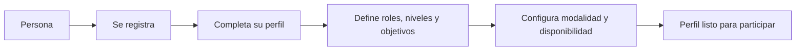
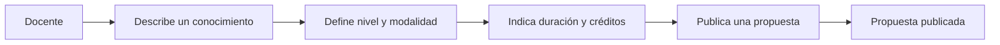
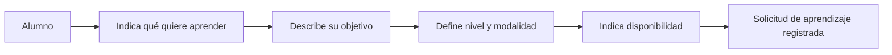
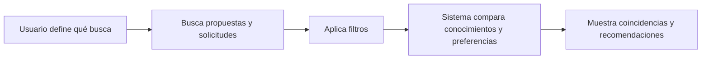
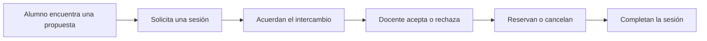
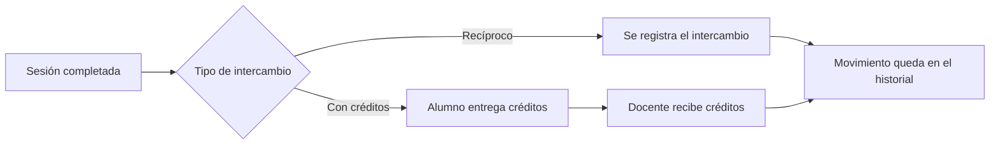
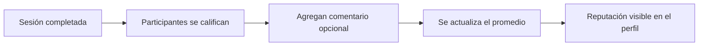
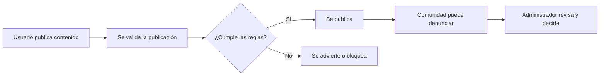

# Backlog del MVP

**Proyecto:** Plataforma de intercambio de aprendizajes  
**Versión:** 1.0 — derivada del MVP aprobado

Las historias se derivan exclusivamente de `docs/mvp.md`. No se asignan prioridades ni estimaciones porque el MVP no las define.

## Épica E1. Acceso y perfiles

### Introducción

Esta épica permite que una persona ingrese a la plataforma y configure la información necesaria para participar como Docente, Alumno o ambas cosas.

### Objetivo y valor

Construir una identidad básica y unas preferencias que permitan encontrar aprendizajes y personas compatibles.

### Alcance

Incluye registro, autenticación, perfil, roles, niveles, objetivos, modalidad y disponibilidad.

### Fuera de alcance

No incluye tipos de cuenta separados por rol ni integración con calendarios externos.

### Storytelling

### Resultado esperado

La persona puede acceder a la plataforma y mantener un perfil completo y editable.

### Trazabilidad

Conceptos principales; Perfiles de usuario; Disponibilidad horaria.

### HU-01 — Registrarse

Como usuario, quiero registrarme para crear una cuenta y utilizar la plataforma.

- **Aceptación:** se completan los datos básicos y se crea la cuenta.
- **MVP:** Funcionalidades principales del MVP; Perfiles de usuario.

### HU-02 — Iniciar y cerrar sesión

Como usuario, quiero iniciar y cerrar sesión para acceder a mis actividades y proteger mi cuenta.

- **Aceptación:** el usuario puede iniciar sesión con sus credenciales y cerrar la sesión activa.
- **MVP:** Funcionalidades principales del MVP.

### HU-03 — Completar el perfil

Como usuario, quiero completar mi nombre, descripción y ubicación general para presentarme ante la comunidad.

- **Aceptación:** el perfil permite guardar esos datos y editarlos.
- **MVP:** Perfiles de usuario.

### HU-04 — Definir roles y preferencias

Como usuario, quiero indicar mis roles, niveles, objetivos, modalidad y disponibilidad para encontrar aprendizajes compatibles.

- **Aceptación:** se pueden configurar Docente y Alumno, niveles por tema, modalidad y franjas horarias.
- **MVP:** Conceptos principales; Perfiles de usuario; Disponibilidad horaria.

## Épica E2. Propuestas de enseñanza

### Introducción

Esta épica permite que un Docente publique un conocimiento o habilidad para que otras personas puedan encontrarlo y solicitar una sesión individual.

### Objetivo y valor

Convertir los conocimientos ofrecidos por la comunidad en propuestas claras, comparables y utilizables dentro del MVP.

### Alcance

Incluye nombre, categoría, descripción, niveles, modalidad, duración, créditos y tipo de clase individual.

### Fuera de alcance

No incluye clases grupales ni equipos docentes.

### Storytelling

### Resultado esperado

Una propuesta publicada contiene la información necesaria para que un Alumno evalúe si desea solicitarla.

### Trazabilidad

Publicación de propuestas de enseñanza.

### HU-05 — Publicar una propuesta

Como Docente, quiero publicar un conocimiento o habilidad para que otros usuarios puedan encontrarlo.

- **Aceptación:** la propuesta incluye nombre, categoría, descripción, niveles, modalidad, duración y créditos.
- **MVP:** Publicación de propuestas.

### HU-06 — Publicar una sesión individual

Como Docente, quiero indicar que mi propuesta es individual para mantener el alcance del MVP.

- **Aceptación:** la propuesta no permite configurar más de un Docente o Alumno en la misma sesión.
- **MVP:** Publicación de propuestas.

## Épica E3. Solicitudes de aprendizaje

### Introducción

Esta épica permite que un Alumno exprese qué desea aprender y con qué objetivo, sin limitarse a opciones predeterminadas.

### Objetivo y valor

Representar necesidades de aprendizaje reales para mejorar la búsqueda y la compatibilidad entre personas.

### Alcance

Incluye conocimiento buscado, objetivo libre, nivel, modalidad y disponibilidad.

### Storytelling

### Resultado esperado

El sistema dispone de una solicitud de aprendizaje suficientemente clara para buscar propuestas adecuadas.

### Trazabilidad

Descripción general; Perfiles de usuario; Disponibilidad horaria.

### HU-07 — Indicar qué aprender

Como Alumno, quiero indicar qué conocimiento deseo aprender para encontrar propuestas adecuadas.

- **Aceptación:** la solicitud permite describir el objetivo libremente, indicar nivel, modalidad y disponibilidad.
- **MVP:** Descripción general; Perfiles de usuario; Disponibilidad horaria.

## Épica E4. Búsqueda y compatibilidad

### Introducción

Esta épica ayuda a las personas a encontrar propuestas, solicitudes y usuarios compatibles según sus conocimientos y objetivos.

### Objetivo y valor

Reducir el esfuerzo de encontrar oportunidades relevantes y favorecer los intercambios recíprocos.

### Alcance

Incluye búsqueda, filtros, compatibilidad basada en reglas y recomendaciones.

### Fuera de alcance

No agrega criterios de compatibilidad que no estén definidos en el MVP.

### Storytelling

### Resultado esperado

Los resultados muestran oportunidades y personas compatibles con información suficiente para decidir el siguiente paso.

### Trazabilidad

Sistema de compatibilidad; Búsqueda y filtros; Descripción general.

### HU-08 — Buscar propuestas y solicitudes

Como usuario, quiero buscar conocimientos, propuestas y solicitudes para encontrar oportunidades relevantes.

- **Aceptación:** se muestran resultados relacionados con el conocimiento o habilidad buscada.
- **MVP:** Búsqueda y filtros.

### HU-09 — Aplicar filtros

Como usuario, quiero filtrar resultados por conocimiento, categoría, nivel, modalidad, ubicación, disponibilidad, intercambio y créditos.

- **Aceptación:** cada filtro puede aplicarse a los resultados y combinarse con otros.
- **MVP:** Búsqueda y filtros.

### HU-10 — Encontrar compatibilidades

Como usuario, quiero encontrar personas compatibles según conocimientos, niveles, objetivos, modalidad y horarios.

- **Aceptación:** los resultados muestran coincidencias y la información principal de cada usuario.
- **MVP:** Sistema de compatibilidad.

### HU-11 — Recibir recomendaciones

Como usuario, quiero recibir recomendaciones de clases y personas compatibles según mis intereses y objetivos.

- **Aceptación:** las recomendaciones consideran objetivos libres, nivel, modalidad y disponibilidad.
- **MVP:** Descripción general; Sistema de compatibilidad.

## Épica E5. Intercambios y sesiones

### Introducción

Esta épica organiza el paso desde una propuesta encontrada hasta la realización y confirmación de una sesión de aprendizaje.

### Objetivo y valor

Permitir que Docentes y Alumnos coordinen intercambios claros, con estados y reglas visibles para ambas partes.

### Alcance

Incluye solicitud, tipo de intercambio, aceptación, rechazo, reserva, cancelación y confirmación de sesiones completadas.

### Fuera de alcance

No incluye sesiones grupales ni intercambios 2×1 u otras equivalencias no definidas.

### Storytelling

### Resultado esperado

Una sesión pasa por estados claros y, al completarse, queda disponible para historial, créditos y calificaciones.

### Trazabilidad

Solicitudes y reservas; Intercambios recíprocos y créditos virtuales; Disponibilidad horaria; Historial de actividades.

### HU-12 — Solicitar una sesión

Como Alumno, quiero solicitar una sesión desde una propuesta para comenzar el intercambio.

- **Aceptación:** la solicitud identifica participantes, tema, fecha, horario, duración, modalidad y tipo de intercambio.
- **MVP:** Solicitudes y reservas.

### HU-13 — Elegir el tipo de intercambio

Como Docente y Alumno, quiero acordar si el intercambio será recíproco o mediante créditos.

- **Aceptación:** se registra el tipo elegido y, si corresponde, el conocimiento ofrecido o la cantidad de créditos.
- **MVP:** Intercambios recíprocos y créditos virtuales.

### HU-14 — Gestionar una solicitud

Como Docente, quiero aceptar o rechazar una solicitud para confirmar si realizaré la sesión.

- **Aceptación:** la solicitud cambia a aceptada o rechazada y conserva su estado.
- **MVP:** Solicitudes y reservas.

### HU-15 — Reservar o cancelar

Como participante, quiero reservar, modificar o cancelar una sesión antes de realizarla.

- **Aceptación:** se aplican los estados y reglas de cancelación definidos por el MVP.
- **MVP:** Solicitudes y reservas; Disponibilidad horaria.

### HU-16 — Completar una sesión

Como participante, quiero marcar la sesión como completada para registrar el resultado del encuentro.

- **Aceptación:** una sesión finalizada queda disponible para historial, créditos y calificación.
- **MVP:** Solicitudes y reservas; Historial de actividades.

## Épica E6. Créditos e historial

### Introducción

Esta épica registra el valor interno de los intercambios mediante créditos y conserva la actividad realizada por cada usuario.

### Objetivo y valor

Hacer transparente el movimiento de créditos y permitir que cada persona consulte su recorrido dentro de la plataforma.

### Alcance

Incluye transferencia de créditos al completar sesiones y consulta de sesiones, aprendizajes, intercambios y movimientos.

### Restricciones

Los créditos son internos de la plataforma y no son dinero ni pueden convertirse en dinero, productos o servicios.

### Storytelling

### Resultado esperado

Los créditos y las actividades quedan registrados de forma consultable para ambas partes.

### Trazabilidad

Intercambios recíprocos y créditos virtuales; Historial de actividades.

### HU-17 — Transferir créditos

Como plataforma, quiero transferir créditos al Docente cuando una sesión mediante créditos se complete.

- **Aceptación:** el Alumno entrega los créditos, el Docente los recibe y el movimiento queda registrado.
- **MVP:** Intercambios recíprocos y créditos virtuales.

### HU-18 — Consultar historial

Como usuario, quiero consultar mis sesiones, aprendizajes, intercambios y movimientos para hacer seguimiento de mi actividad.

- **Aceptación:** se muestran sesiones solicitadas, aceptadas, canceladas y completadas, además de créditos y temas.
- **MVP:** Historial de actividades.

## Épica E7. Calificaciones y reputación

### Introducción

Esta épica permite que las personas valoren sus experiencias de aprendizaje una vez finalizada la sesión.

### Objetivo y valor

Generar señales de confianza para ayudar a la comunidad a evaluar futuras propuestas y participantes.

### Alcance

Incluye puntuación de 1 a 5, comentario opcional y cálculo de la calificación promedio.

### Restricciones

Solo pueden calificarse participantes de una sesión marcada como completada.

### Storytelling

### Resultado esperado

Cada perfil puede mostrar una reputación basada en experiencias reales y completadas.

### Trazabilidad

Calificaciones y reputación; Historial de actividades.

### HU-19 — Calificar una experiencia

Como participante, quiero calificar a la otra persona después de completar una sesión para aportar información a la comunidad.

- **Aceptación:** solo se puede calificar una sesión completada, con puntuación de 1 a 5 y comentario opcional.
- **MVP:** Calificaciones y reputación.

## Épica E8. Seguridad y administración

### Introducción

Esta épica protege el carácter educativo, lícito y seguro de la plataforma y brinda herramientas básicas de revisión administrativa.

### Objetivo y valor

Prevenir contenidos inadecuados y permitir que las denuncias y sanciones sean revisadas por una persona administradora.

### Alcance

Incluye categorías permitidas, palabras prohibidas, validación, denuncias, advertencias, revisión, ocultamiento de publicaciones y suspensión o reactivación de cuentas.

### Restricciones

Las sanciones definitivas requieren revisión administrativa y la plataforma no permite ofrecer servicios profesionales.

### Storytelling

### Resultado esperado

La plataforma puede detectar, recibir, revisar y gestionar contenidos o cuentas que incumplan las reglas del MVP.

### Trazabilidad

Contenidos no permitidos y seguridad; Panel de administración.

### HU-20 — Validar y denunciar contenidos

Como plataforma, quiero validar publicaciones y permitir denuncias para limitar contenidos ilegales, riesgosos o ajenos al aprendizaje.

- **Aceptación:** se aplican categorías y expresiones prohibidas, se muestran advertencias y se pueden denunciar publicaciones o cuentas.
- **MVP:** Contenidos no permitidos y seguridad.

### HU-21 — Administrar denuncias y cuentas

Como Administrador, quiero revisar denuncias, ocultar publicaciones y suspender o reactivar cuentas cuando corresponda.

- **Aceptación:** las sanciones definitivas requieren revisión humana y quedan registradas.
- **MVP:** Panel de administración; Contenidos no permitidos y seguridad.

### HU-22 — Validar conocimientos y estudios

Como Docente, quiero cargar títulos, certificados o referencias para aumentar la confianza en mis propuestas.

- **Aceptación:** la documentación puede revisarse y el perfil muestra un nivel de verificación.
- **MVP:** Contenidos no permitidos y seguridad.

## Pendientes sin decisión aprobada

- Límites, reglas y revisión del cálculo orientativo de créditos mediante LLM.
- Documentos aceptados y procedimiento de validación de estudios.
- Diseño final de las solicitudes de aprendizaje.
- Canal de contacto entre participantes.

## Exclusiones del MVP

- Clases grupales.
- Equipos docentes.
- Intercambios 2×1 u otras equivalencias.
- Sesiones con más de un Docente o más de un Alumno.
