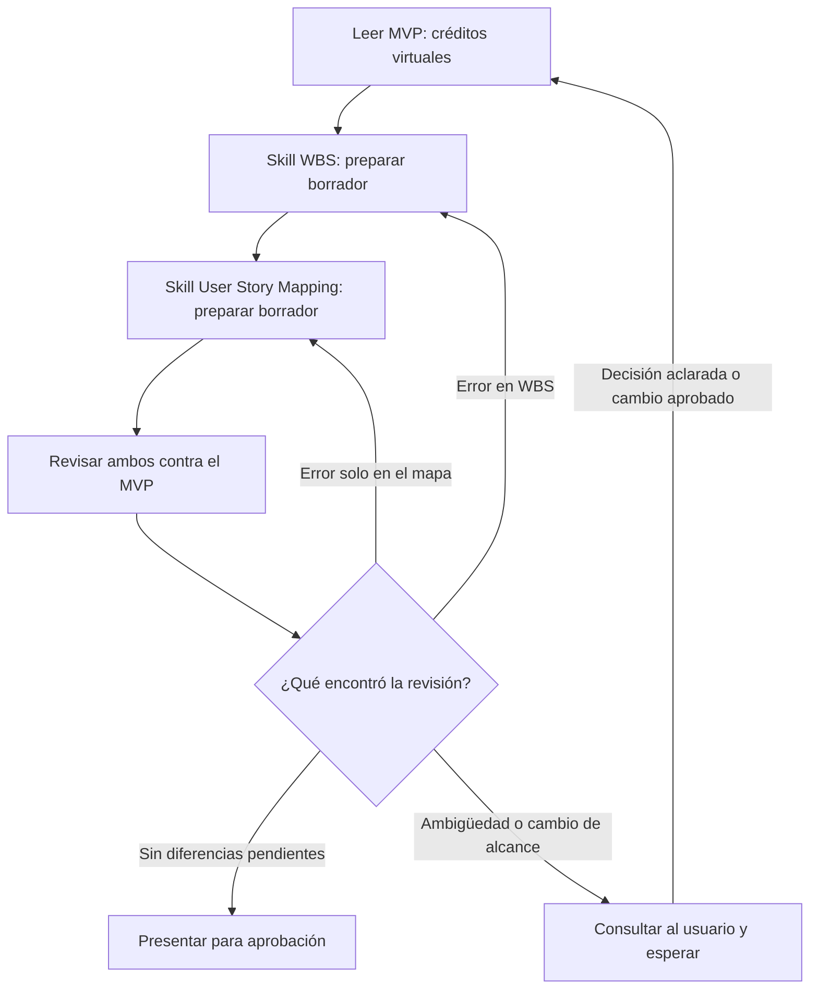

# Un graph básico de skills

Este ejemplo conecta dos skills existentes y una revisión. Se recorre con el agente en una conversación: no necesita Python ni instala herramientas. El documento describe el flujo; por sí solo no ejecuta nada.

**Objetivo:** preparar una WBS y un mapa de historias coherentes con el MVP, empezando por un solo tema: los créditos virtuales.

## El grafo

La WBS va antes del mapa porque el skill de User Story Mapping necesita la WBS como entrada. Corregir la WBS obliga a revisar también el mapa que depende de ella.

## Las piezas conectadas

| Nodo | Qué lee | Qué produce | Quién controla su resultado |
|---|---|---|---|
| Leer fuente | [MVP](mvp.md), [reglas](../AGENTS.md) y [alcance futuro](alcance-futuro.md) | Reglas del tema elegido y dudas | Revisión contra las fuentes originales |
| Preparar WBS | Fuente y [skill WBS](../skills/wbs-por-entregables/SKILL.md), incluidas sus referencias | Borrador de entregables con trazabilidad | Nodo de revisión |
| Preparar mapa | Fuente, borrador WBS y [skill User Story Mapping](../skills/user-story-mapping/SKILL.md), incluidas sus referencias | Borrador del recorrido y las historias con trazabilidad | Nodo de revisión |
| Revisar | MVP original y ambos borradores | Diferencias concretas o resultado sin diferencias detectadas | Usuario al evaluar el informe |

La revisión es un paso de este flujo, no un skill nuevo ni necesariamente otro agente. Para este ejercicio, el borrador WBS de la conversación es la entrada provisional del mapa; no reemplaza la WBS guardada.

## Memoria compartida y anclas

La memoria de esta ejecución es la conversación: reglas consultadas, dos borradores, diferencias detectadas y cantidad de revisiones. Los archivos existentes aportan contexto; los borradores se presentan en el chat.

Las anclas son la especificación y las reglas aprobadas. Por ejemplo, el MVP establece que los créditos son internos y no pueden convertirse en dinero. Que la WBS y el mapa coincidan entre sí no alcanza: ambos deben respetar esa regla.

En cada revisión:

1. Verificar que las reglas del tema estén representadas en los borradores.
2. Pedir una sección concreta del MVP como respaldo de cada entregable e historia.
3. Señalar contradicciones, agregados sin respaldo y dudas sin resolver. No cambiar el MVP para justificar el borrador.

## El loop y su final

El camino **preparar → revisar → corregir → revisar** es el loop dentro del grafo. El informe indica qué corregir y a qué nodo volver.

- Si no se detectan diferencias pendientes, presentar el resultado para aprobación. Esto no garantiza que sea perfecto.
- Si hay una ambigüedad o un cambio de alcance, presentar la pregunta concreta y esperar la decisión del usuario.
- Hacer como máximo dos rondas de revisión por ejecución. Si quedan problemas, mostrarlos y terminar el ejercicio con pendientes explícitos.
- No guardar los borradores en `docs/wbs.md` ni `docs/usm.md` hasta su aprobación. No modificar automáticamente el MVP.

## Ejemplo pequeño

**Caso hipotético, no un hallazgo del proyecto:** el borrador del mapa incluye “Como Docente, quiero retirar mis créditos en dinero”.

La revisión vuelve a la sección “Intercambios recíprocos y créditos virtuales” del MVP y detecta la contradicción. Si la WBS está correcta, devuelve solo el mapa al nodo de preparación para retirar esa historia y luego revisarlo otra vez. No cambia la especificación para aceptar la historia.

Así se ve la conexión: una salida recibe una revisión contra una fuente y esa revisión determina el siguiente paso.

## Cómo probarlo en una conversación

Copiar este pedido:

> Recorré el grafo de docs/graph-de-skills.md solo para créditos virtuales. Usá los skills y sus referencias. Mostrá cada nodo por el que pasás, prepará borradores breves en el chat y revisalos contra el MVP. Indicá cualquier regreso a un nodo anterior y respetá el máximo de dos revisiones. No edites archivos; presentá el resultado y los pendientes para mi revisión.

El ejemplo anterior en `ejemplos/graph-basico/` es una demostración separada de ejecución en Python. Este documento muestra cómo conectar el trabajo de los skills sin programar un ejecutor.
