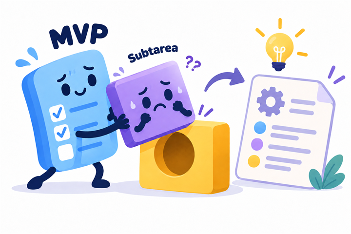
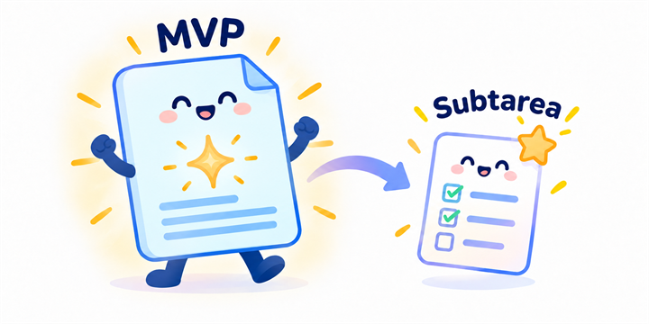
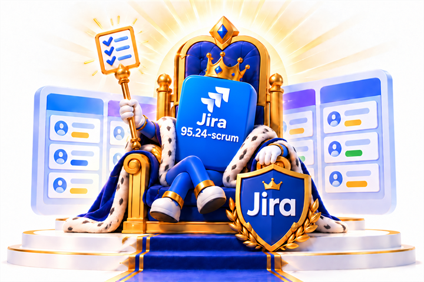

# Mensaje al equipo: normalización de la planificación

Equipo, hicimos una normalización de la planificación del proyecto.

Al comienzo trabajábamos con una nomenclatura WBS anterior, antes de tener Jira y el flujo actual de derivación. Algunas tareas ya fueron iniciadas con esa nomenclatura.

A partir de ahora, la referencia oficial será:

```text
[1.0.0] Épica
[1.1.0] Historia de usuario
[1.1.1] Subtarea Backend o Frontend
[1.1.1.1] Ítem técnico de checklist
```

La nomenclatura anterior no invalida ni elimina el trabajo realizado. Se conserva como referencia histórica y puede consultarse en la matriz de mapeo.

La cadena oficial de trabajo es:

```text
MVP → backlog → historias → subtareas → checklist técnica
```

Por lo tanto:

- `docs/mvp-v3.md` es la fuente de verdad del producto.
- `docs/backlog.md` contiene las historias derivadas.
- `docs/subtareas.md` contiene las tareas técnicas y contratos API.
- Jira es el tablero operativo.
- Las checklists agregan detalle técnico sin crear nuevas issues.

## Granularidad derivada

La derivación mediante skills genera una estructura inicial, pero no es rígida. Confiamos en el skill para decidir el nivel de granularidad adecuado y no debemos forzarlo a producir una subtarea específica.

Si una subtarea Jira queda demasiado grande, puede dividirse en varias subtareas hermanas bajo la misma HU. No se deben crear subtareas hijas de otras subtareas.

## Por qué no debemos forzar la derivación



Forzar por fuera de la decisión del skill que algo sea una subtarea puede generar:

- fragmentación artificial;
- duplicación de responsabilidades;
- dispersión de criterios;
- diferencias entre el MVP, la documentación derivada y Jira.

Como estamos trabajando con un enfoque de *spec-driven development*, la estructura debe surgir de la especificación refinada y de su derivación automática. En este proceso confiamos en la IA para interpretar el MVP y proponer la granularidad, y respetamos su decisión salvo que detectemos un problema en la especificación de origen.

## Cómo hacer que nazca una subtarea



Si una capacidad parece requerir una subtarea independiente por su responsabilidad, comportamiento o impacto funcional, primero debemos expresarla con suficiente claridad en el MVP y volver a derivar la planificación.

```text
MVP refinado
    ↓
derivación mediante skills
    ↓
HU y subtareas adecuadas
```

Puede ser necesario iterar y refinar el MVP varias veces hasta que el skill detecte esa independencia y genere la subtarea de forma natural.

## Si la subtarea nunca aparece

Si después de sucesivos refinamientos la subtarea sigue sin aparecer, debemos aceptar que probablemente no sea una unidad independiente. Puede estar cubierta por otra tarea, ser un criterio de aceptación o corresponder a una checklist técnica.

En ese caso, no debemos ir contra la derivación: debemos revisar nuestra descomposición conceptual.

Para cualquier referencia antigua:

```text
nomenclatura vieja → buscar equivalencia → continuar en Jira actual
```

Les pedimos usar la nueva nomenclatura para nuevos documentos, tareas, commits y conversaciones técnicas, sin duplicar trabajo que ya exista.

## Jira como autoridad operativa

Para el trabajo cotidiano, Jira es la fuente única de verdad operativa: allí deben consultarse el estado vigente, la jerarquía, las asignaciones, los sprints y el avance de las issues. La documentación explica el criterio y el MVP define el producto; Jira concentra la ejecución actual del equipo.


