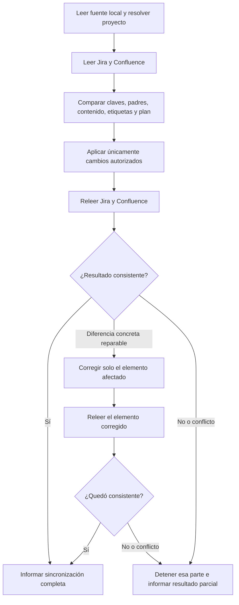

# Actualizar Jira

Usar este skill únicamente cuando el usuario solicite crear, actualizar o sincronizar issues de Jira a partir de la documentación local aprobada. La sincronización autorizada incluye siempre la actualización documental del MVP activo y del MVP resumido en la sección Documentos asociada al proyecto.

## Flujo visual de sincronización

La sincronización externa usa un loop corto de verificación, distinto del loop de refinamiento de la planificación:



## Fuente y alcance

- Leer `AGENTS.md` y confirmar qué versión del MVP está activa.
- Leer el archivo de la versión activa, por defecto `docs/mvp-v3.md`.
- Leer `docs/mvp-resumido.md`.
- Leer `docs/backlog.md` y `docs/subtareas.md`.
- Leer `docs/sprints.md` cuando exista. La sincronización completa de la planificación incluye sus story points, objetivos de sprint y asignaciones de HU, siempre dentro del plan aprobado y del alcance solicitado. Si falta, sincronizar los artefactos disponibles e informar que los sprints quedan pendientes; no inventar una distribución.
- Considerar la documentación local como fuente de la sincronización, no el contenido previo de Jira.
- No modificar el MVP, WBS, USM, backlog ni subtareas locales desde este skill.

## Política de versionado en Jira

- Toda épica, historia y subtarea nueva derivada del MVP activo debe recibir la etiqueta `mvp-v3` cuando la fuente activa sea `docs/mvp-v3.md`.
- Si cambia la versión activa, usar una etiqueta equivalente y explícita, por ejemplo `mvp-v4`.
- Las épicas deben usar numeración WBS visible entre corchetes: `[1.0.0]`, `[2.0.0]`, `[3.0.0]`, seguida del nombre de la épica. No usar prefijos `E1`, `E2`, `E3`.
- Las historias deben usar numeración WBS derivada de su épica entre corchetes: `[1.1.0]`, `[1.2.0]`, `[2.1.0]`, etc. No usar prefijos `HUxx` en el resumen visible.
- Las subtareas deben usar el tercer nivel WBS derivado de su historia y conservar su tipo técnico: `[1.1.1] [Backend] ...` o `[1.1.2] [Frontend] ...`. Los endpoints, cuerpos HTTP, respuestas y detalles de implementación deben quedar en la descripción, nunca en el título.
- En las subtareas `Backend/API REST`, la descripción debe separar claramente la especificación técnica: usar bloques de código `http` para endpoints, headers y parámetros, bloques `json` para request/response bodies cuando corresponda, y texto separado para reglas, estados y códigos HTTP. No dejar contratos técnicos extensos como texto inline.
- Cuando una subtarea incluya varios endpoints, explicar la responsabilidad de cada método (por ejemplo, `GET` consulta y `PATCH` modifica parcialmente), indicando para cada uno si recibe body y qué response espera.
- Los request bodies y parámetros deben usar valores representativos y declarar sus tipos de datos. Para arrays se debe especificar el tipo de sus items, por ejemplo `string[]` o `array<object>`, y para fechas/horas usar `date` y `time`.
- Cada endpoint debe explicar su propósito y sus parámetros: indicar qué representa cada path/query parameter o header, dónde se envía, su tipo y un ejemplo concreto. Cuando una subtarea tenga varios métodos, describirlos por separado aunque compartan el mismo bloque HTTP.
- Las issues históricas no deben modificarse ni recibir etiquetas retroactivamente, salvo autorización explícita.
- La etiqueta debe aplicarse a todos los niveles para que los filtros, tableros, dashboards y reportes incluyan el conjunto completo de la versión.

## Flujo obligatorio

1. Resolver el proyecto, el sitio de Jira y el espacio de Confluence conectados.
2. Buscar en la sección Documentos las páginas correspondientes al MVP activo y a `MVP resumido`.
3. Actualizar esas páginas con el contenido local vigente; si no existen, crearlas allí. No crear duplicados por cambios de nombre o ejecuciones repetidas.
4. Consultar las épicas, historias y subtareas existentes.
5. Comparar por claves, títulos, padres y contenido antes de crear o editar.
6. Proponer o ejecutar únicamente los cambios incluidos en la autorización del usuario.
7. Aplicar la etiqueta de versión a cada issue nueva: épica, historia y subtarea.
8. Evitar duplicados y conservar estados, responsables y otros campos no solicitados. Las estimaciones y asignaciones de sprint se actualizan cuando la sincronización incluya el plan de `docs/sprints.md`; fuera de ese alcance se conservan.
9. Aplicar la sección **Estimaciones y sprints** cuando corresponda.
10. Verificar al finalizar la publicación documental, la cantidad de issues creadas o actualizadas, sus etiquetas, relaciones, puntos y distribución final por sprint.

## Loop de verificación posterior

La sincronización debe ejecutar una única verificación posterior a las escrituras:

1. Leer nuevamente Jira y Confluence después de aplicar los cambios.
2. Comparar issues, padres, títulos, descripciones, etiquetas, puntos, sprints y relaciones con la fuente local autorizada. En cada subtarea `[Backend]`, verificar que la descripción tenga endpoint y verbo, request —o `sin body`—, response exitosa y errores relevantes; si es una tarea interna sin endpoint, debe declararlo como excepción con entrada, salida y pruebas.
3. Si aparece una diferencia concreta y reparable, corregir únicamente ese elemento y releerlo una vez.
4. Si persiste una diferencia, hay una respuesta ambigua o existe un conflicto de estado, detener esa parte e informar el resultado parcial.

No repetir escrituras a ciegas ni iniciar un loop indefinido. La condición de corte es que la sincronización quede consistente, incluidos los contratos mínimos de Backend, o que una parte quede detenida con el motivo documentado. Este loop valida la aplicación externa; no rediseña el backlog ni modifica el MVP.

## Estimaciones y sprints

- Resolver historias locales a claves Jira por numeración WBS, nombre, versión y proyecto; no usar claves históricas sin comprobar su correspondencia. Resolver primero las historias recién creadas. Ante duplicados ambiguos, detener solo esa asignación.
- Leer los sprints del tablero con todas sus páginas y descubrir los campos de estimación del sitio. No fijar IDs de campos, tableros o sprints en el skill.
- Antes de escribir, comprobar cobertura del plan, sumas, capacidad por sprint y ausencia de HU duplicadas. Distinguir estimaciones provisionales de aprobadas; no aplicar una propuesta pendiente como si ya estuviera aprobada. Si el pedido explícito es aplicar esa propuesta, esa instrucción basta y no requiere una nueva confirmación.
- Reutilizar los sprints existentes por ID verificado o por nombre inequívoco en el tablero. Crear únicamente los que falten y estén incluidos en la planificación autorizada. Conservar la correspondencia local–Jira durante toda la operación para evitar duplicados.
- Cargar los puntos de las HU y moverlas a los sprints definidos. Las subtareas mantienen su vínculo con la HU; no sumar sus puntos otra vez ni asignar épicas como historias del sprint. Verificar el comportamiento de las subtareas en el tablero.
- Actualizar nombres y objetivos únicamente según el plan autorizado. Preservar fechas y estados existentes salvo pedido explícito de reprogramación o cambio de estado. Para sprints nuevos, usar fechas aprobadas si existen; en caso contrario crearlos futuros sin inventar fechas, si la herramienta lo permite.
- Al usar operaciones que reescriben el sprint completo, reenviar los valores actuales de todos los campos que deban conservarse. No iniciar ni cerrar sprints como efecto de sincronizar.
- Una HU ausente del plan se conserva donde está. Mover al backlog solo si el plan autorizado lo indica expresamente; no vaciar sprints ni eliminar los que sobren automáticamente.
- Si una HU cambió de sprint o estimación desde la lectura, resolver la discrepancia antes de sobrescribir. Ante respuesta ambigua, releer antes de reintentar; no repetir creaciones a ciegas. Informar resultados parciales si persiste un error.
- Releer al terminar: cada HU planificada debe tener los puntos y sprint previstos. Comparar totales, listar sprints creados/reutilizados y HU pendientes, y confirmar que no se cambiaron fechas o estados fuera del alcance.

## Seguridad de la sincronización

- La derivación local no autoriza por sí sola cambios en Jira.
- Requiere una instrucción explícita como “sincronizar la derivación con Jira”.
- Cuando se autoriza la sincronización, la actualización del MVP activo y de `MVP resumido` en Documentos forma parte obligatoria de la operación.
- Si no se puede resolver la sección Documentos o una página existente, detener esa publicación y reportarlo; no crear páginas fuera del espacio del proyecto sin autorización.
- Si el usuario pide solo revisar o comparar, no crear ni editar issues.
- Si pide solo cargar puntos o distribuir HU, limitar las mutaciones a ese pedido; esa operación acotada no autoriza publicaciones documentales ni otras modificaciones externas. La publicación del MVP y su resumen se mantiene para la sincronización completa.
- Si hay diferencias de alcance o decisiones ambiguas, detener la sincronización de esa parte y presentarlas.
- No eliminar issues automáticamente. Proponerlas como obsoletas o pedir autorización específica.

## Trazabilidad

Mantener la relación:

```text
MVP activo → Épica → Historia de usuario → Subtarea
```

Las descripciones deben conservar los criterios de aceptación y, en subtareas Backend/API REST, los bloques HTTP y JSON definidos en `docs/subtareas.md`, manteniendo separados endpoints, request, response y reglas de negocio.
