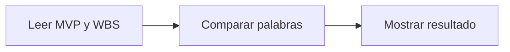

# Un graph mínimo para este proyecto

Este ejemplo es un **grafo dirigido lineal** con tres nodos. Usa Python sin dependencias externas y solo lee los documentos del proyecto.



## Ejecutarlo

Desde la carpeta raíz del repositorio, con Python 3:

```sh
python ejemplos/graph-basico/graph.py
```

## Dónde está el grafo

- **NODOS** asocia cada paso con una función: `leer`, `comparar` y `mostrar`.
- **ARISTAS** define las conexiones: `leer → comparar → mostrar → fin`.
- **estado** conserva los textos y resultados para que los nodos compartan información.
- **ejecutar()** recorre las conexiones desde el nodo `leer` hasta encontrar `None`.

Una cadena también es un grafo: no hace falta agregar bifurcaciones para que lo sea. Las conexiones están declaradas como datos en `ARISTAS`, separadas de lo que hace cada función.

El `while` es el bucle del ejecutor que recorre el grafo. **El grafo no tiene ciclos**: ningún nodo vuelve a uno anterior.

## Qué comprueba

Busca las palabras `perfiles`, `créditos` y `calificaciones` en el MVP y en la WBS, sin distinguir mayúsculas. Informa por separado si aparecen en cada documento.

Es una demostración del flujo, no una revisión real del alcance: encontrar una palabra no demuestra que el entregable esté bien definido. No usa IA ni ejecuta skills, y no modifica los documentos.

## Un primer ejercicio

Agregá `reservas` a `TEMAS` y ejecutalo otra vez. Observá cómo cambia el resultado sin cambiar los nodos ni sus conexiones.
