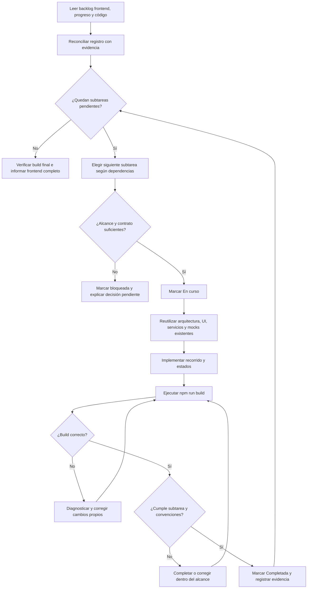

# Implementar todo el frontend del MVP 9524

El código está en `proyecto-sdd/frontend/`. Ejecutar los comandos npm desde esa carpeta.
Las rutas `proyecto-sdd/` y `AGENTS.md` se resuelven desde la raíz del repositorio.

Completar todas las subtareas marcadas como Frontend en el backlog vigente. Trabajar incrementalmente sobre el repositorio existente: no regenerar la aplicación, no reemplazar funcionalidad correcta y no repetir subtareas ya completadas.

Cuando el usuario invoque el skill sin indicar una subtarea, continuar automáticamente desde la primera subtarea pendiente hasta completar todo el backlog frontend o encontrar una condición de detención real.

## Fuentes de verdad

Antes de implementar:

1. Leer `proyecto-sdd/mvp-v3.md`, `proyecto-sdd/backlog.md` y `proyecto-sdd/subtareas.md` del proyecto de planificación `9524`.
2. Extraer de `proyecto-sdd/subtareas.md` todas las subtareas etiquetadas `[Frontend]`; no asumir que la lista histórica sigue vigente sin comprobarla.
3. Leer y aplicar el skill `convenciones-frontend` del proyecto `9524`.
4. Leer `proyecto-sdd/frontend-progress.md` de este repositorio si existe.
5. Inspeccionar la implementación real antes de confiar en el registro de progreso.
6. Si el registro contradice al código, corregir el registro según la evidencia y documentar el ajuste.
7. Si las fuentes funcionales se contradicen, detenerse y presentar la contradicción concreta; no inventar una regla de producto.

## Decisiones vigentes

- Framework: Vue 3 con Composition API.
- UI: PrimeVue con su tema adoptado y PrimeFlex para layout.
- Datos: usar mocks mientras no exista una API disponible.
- Integración: aislar el acceso a datos detrás de servicios o adaptadores intercambiables; las vistas no dependen directamente del mock.
- Persistencia mock: usar almacenamiento local cuando ayude a recorrer el flujo entre recargas, sin guardar credenciales reales ni datos sensibles.
- Pruebas automatizadas: no agregarlas ni exigirlas por ahora, salvo solicitud explícita del usuario. Esta decisión no elimina la verificación funcional ni el build.
- Alcance: implementar todas las subtareas frontend; no implementar el backend ni modificar la planificación fuente.

## Progreso e idempotencia

Mantener `proyecto-sdd/frontend-progress.md` como índice operativo, con una fila por cada subtarea frontend vigente y uno de estos estados:

- `Pendiente`: no existe una implementación suficiente.
- `En curso`: la subtarea comenzó pero todavía no cumple su definición.
- `Bloqueada`: existe una condición de detención documentada.
- `Completada`: el código fue inspeccionado, el flujo es navegable y el build pasa.

Antes de modificar una subtarea marcada `Completada`, verificar su implementación. Conservarla si sigue cumpliendo. Solo reabrirla cuando exista evidencia concreta de una regresión, contradicción o requisito nuevo.

Actualizar el registro después de verificar cada subtarea. El registro ayuda a descubrir qué sigue, pero nunca reemplaza la inspección del código.

## Flujo de trabajo completo

1. Construir la lista vigente de subtareas frontend desde el backlog.
2. Compararla con `proyecto-sdd/frontend-progress.md` y con el código existente.
3. Elegir la primera subtarea realmente pendiente respetando dependencias funcionales.
4. Marcarla `En curso`.
5. Leer su historia, criterios y contratos Backend asociados.
6. Delimitar rutas, componentes, estados, servicios y mocks necesarios.
7. Implementar el recorrido completo reutilizando lo existente.
8. Incluir los estados aplicables de carga, vacío, error, éxito y permisos.
9. Ejecutar `npm run build`.
10. Corregir errores propios y repetir el build hasta que pase.
11. Revisar la implementación contra la subtarea y `convenciones-frontend`.
12. Marcarla `Completada` y registrar una evidencia breve.
13. Continuar con la siguiente subtarea pendiente.
14. Terminar únicamente cuando no queden subtareas frontend pendientes o aparezca una condición de detención.

## Diagrama del flujo



## Loops controlados

Loop interno de cada subtarea:

```text
implementar → ejecutar build → diagnosticar → corregir → ejecutar build
```

Loop del backlog frontend:

```text
detectar siguiente pendiente → implementar → verificar → registrar → continuar
```

No detenerse entre subtareas únicamente para pedir permiso de continuar. La invocación del skill autoriza completar el backlog frontend dentro de las decisiones vigentes. Esto no autoriza commits, pushes, cambios de backend ni acciones externas.

## Condiciones de detención

Detener el loop, marcar la subtarea afectada `Bloqueada` y explicar el motivo cuando:

- falte una decisión funcional que cambie materialmente el comportamiento observable;
- el contrato documentado sea insuficiente o contradictorio y no exista una adaptación mock reversible;
- resolver la subtarea requiera implementar backend o ampliar el producto fuera del MVP;
- haya que reemplazar PrimeVue o crear un sistema visual propio;
- una dependencia requiera una migración amplia no prevista;
- la misma falla reaparezca después de intentos razonables y no exista una corrección segura.

No detenerse por decisiones pequeñas, reversibles y coherentes con los patrones ya adoptados. Documentar esas suposiciones en el registro de progreso.

## Arquitectura de integración

Mantener esta separación conceptual, adaptándola a la estructura real del repositorio:

```text
vista → store o composable → servicio de dominio → adaptador mock
                                            └──→ adaptador HTTP futuro
```

- Mantener lógica de negocio y transformación fuera de las vistas.
- Centralizar latencia simulada, errores y selección de escenarios en la capa mock.
- Conservar nombres y estructuras compatibles con el contrato REST documentado.
- Reutilizar componentes y patrones existentes antes de crear otros.
- Evitar abstracciones generales sin usos reales.

## Verificación por subtarea

Antes de marcar una subtarea `Completada`, comprobar:

- [ ] Coincide con su historia y criterios.
- [ ] El flujo puede recorrerse desde una ruta o acción visible.
- [ ] La UI distingue los estados relevantes.
- [ ] El acceso a datos está aislado de las vistas.
- [ ] Los mocks no contienen secretos ni se presentan como datos reales.
- [ ] Reutiliza la arquitectura y componentes existentes.
- [ ] `npm run build` finaliza correctamente.
- [ ] Se respetó la decisión vigente de no agregar tests.

## Entrega final

Al finalizar o detenerse, informar:

- subtareas completadas en la ejecución;
- progreso total del frontend;
- rutas y flujos navegables;
- datos que continúan siendo mock;
- decisiones reversibles adoptadas;
- bloqueos y dependencias futuras del backend;
- resultado del último build.

