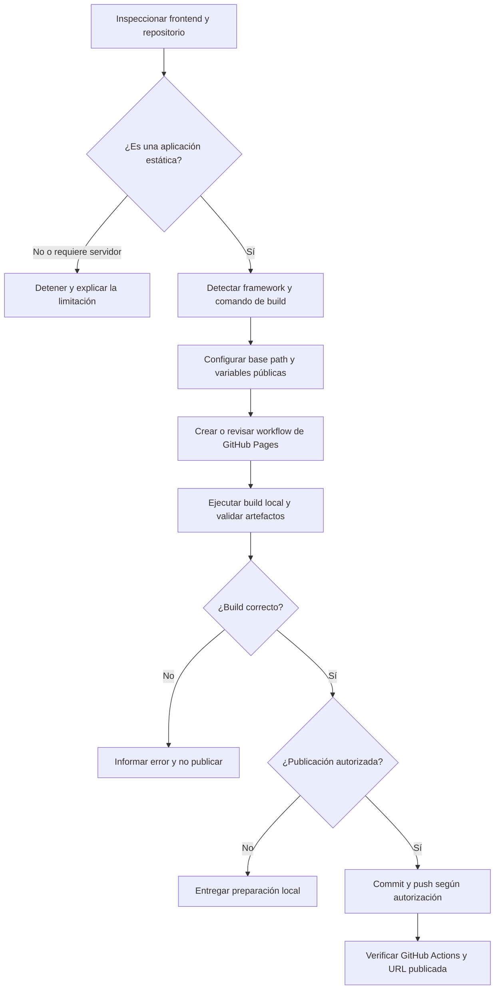

# Publicar frontend

Usar este skill únicamente para preparar o publicar el frontend de una aplicación. El destino preferido es GitHub Pages mediante GitHub Actions. No despliega el backend, la base de datos ni servicios privados.

## Alcance y autorización

- Distinguir entre **preparar** la publicación y **publicarla**.
- Preparar puede incluir configurar el workflow, ajustar el build y documentar la URL esperada.
- Publicar implica cambios externos: commit, push, ejecución de GitHub Actions o activación de Pages. Ejecutarlo solo cuando el usuario lo solicite explícitamente.
- No publicar secretos. Las variables incorporadas al frontend quedan visibles para los usuarios; solo incluir valores públicos, como una URL pública de API.
- No sobrescribir configuraciones existentes de despliegue sin revisarlas y conservarlas cuando sigan siendo compatibles.

## Flujo

## Inspección inicial

1. Identificar la raíz real del frontend y el repositorio remoto.
2. Detectar el framework y el gestor de paquetes a partir de `package.json`, lockfile y configuración existente.
3. Confirmar el comando de build y la carpeta de salida (`dist`, `build` u otra).
4. Revisar si el frontend necesita una API externa y comprobar que la URL se configure como variable pública de build.
5. Revisar si ya existe `.github/workflows`, GitHub Pages o un proveedor de hosting configurado.

Si el repositorio contiene frontend y backend, limitar los cambios al frontend y al workflow necesario para publicarlo.

## GitHub Pages

- Usar GitHub Actions como fuente de publicación.
- El workflow debe construir el frontend y publicar el artefacto generado con las acciones oficiales de Pages.
- Conceder únicamente los permisos necesarios: lectura del contenido, escritura de Pages y escritura del token OIDC.
- Ejecutar el despliegue desde la rama principal o desde la rama que el usuario indique explícitamente.
- No publicar la carpeta fuente si el framework requiere un build; publicar la carpeta generada.

### Rutas y assets

- Si la aplicación se sirve bajo `https://usuario.github.io/repositorio/`, configurar el `base` o equivalente con `/<repositorio>/` cuando el framework lo requiera.
- Si se usa un dominio raíz o dominio personalizado, usar la base correspondiente a ese dominio.
- Verificar que CSS, JavaScript, imágenes, fuentes y favicon carguen desde la URL publicada.
- Si se usa routing del lado del cliente, comprobar el comportamiento al recargar una ruta interna y documentar la solución necesaria para GitHub Pages.

## Validaciones

Antes de publicar, comprobar:

- el build local termina sin errores;
- la carpeta de salida existe y contiene el artefacto principal;
- no se incluyeron secretos ni archivos `.env` privados;
- la URL pública de la API, si existe, apunta al backend correcto;
- el workflow usa la carpeta de salida real;
- la aplicación no depende de un proceso Python o Node ejecutándose en GitHub Pages.

Después de publicar, verificar la ejecución de GitHub Actions y abrir la URL resultante. Comprobar al menos la carga inicial, los assets principales, una ruta interna si existe y una llamada básica al backend si la aplicación la necesita.

## Condiciones de corte

- Si el frontend no puede compilar, detenerse sin publicar.
- Si requiere renderizado del servidor, WebSockets persistentes o ejecución de backend, explicar que GitHub Pages no alcanza y proponer separar frontend y backend.
- Si falta una decisión necesaria sobre repositorio, rama, dominio o URL pública de API, preparar lo que sea inequívoco y dejar esa decisión pendiente.
- Si GitHub Actions falla, corregir solo una causa concreta y verificable; si vuelve a fallar o hay un conflicto de configuración, detenerse e informar el resultado parcial.

## Resultado esperado

Informar siempre:

- framework detectado y comando de build;
- carpeta publicada;
- repositorio y rama usados;
- workflow creado o reutilizado;
- URL publicada, si la hubo;
- validaciones ejecutadas;
- errores o decisiones pendientes.
