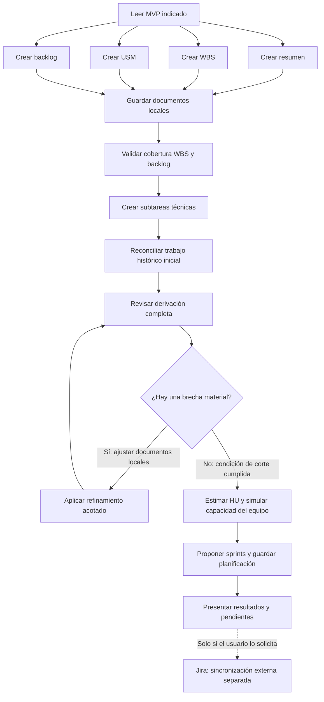

# Derivar planificación del MVP

Seguir este grafo. Las rutas `proyecto-sdd/` y `AGENTS.md` se resuelven desde la raíz del repositorio.

La fuente por defecto es `proyecto-sdd/mvp-v3.md`. Solo usar `proyecto-sdd/mvp-v1.md` o `proyecto-sdd/mvp-v2.md` cuando el usuario lo indique explícitamente para una comparación o migración. Nunca mezclar versiones.

## Nodos y conexiones

1. **Leer MVP:** leer `AGENTS.md` y el contenido completo de la versión indicada (`proyecto-sdd/mvp-v1.md`, `proyecto-sdd/mvp-v2.md` o `proyecto-sdd/mvp-v3.md`). Usar esa misma versión como fuente de requisitos de todas las ramas. Registrar en los documentos qué versión se usó y no mezclar versiones.
2. **Crear WBS:** aplicar [crear-wbs](../crear-wbs/SKILL.md) y sus referencias. Preparar el borrador a partir del MVP.
3. **Crear USM:** aplicar [crear-usm](../crear-usm/SKILL.md) y sus referencias. Preparar el borrador a partir del MVP.
4. **Crear backlog:** aplicar [crear-backlog](../crear-backlog/SKILL.md). Preparar las épicas e historias directamente a partir del MVP, sin leer la WBS ni el USM como entradas.
5. **Crear resumen:** redactar una vista rápida del espíritu, flujo, roles, entidad central y principios del MVP. Guardar en `proyecto-sdd/mvp-resumido.md`. No incluir secciones de alcance incluido ni de exclusiones; declarar siempre que es un artefacto derivado, nunca fuente de verdad.
6. **Guardar documentos locales:** cuando el usuario solicite derivar el plan completo, guardar los resultados aprobados o solicitados en `proyecto-sdd/wbs.md`, `proyecto-sdd/usm.md` y `proyecto-sdd/backlog.md`.
7. **Validar cobertura WBS y backlog:** comprobar en ambos sentidos que cada paquete WBS dentro del MVP esté cubierto por una o más épicas, historias o tareas, y que cada elemento del backlog tenga respaldo en el MVP y ubicación en la WBS. No exigir una relación uno a uno. Si no hay diferencias, informar la validación sin crear una matriz permanente. Si hay brechas, presentarlas y proponer el ajuste del artefacto derivado correspondiente; guardar un informe solo cuando el usuario lo solicite o la decisión deba quedar pendiente.
8. **Crear subtareas técnicas:** después de disponer de un backlog local validado o con brechas explícitamente informadas, aplicar [create-subtereas](../create-subtereas/SKILL.md) para decidir la descomposición técnica necesaria de cada historia aprobada. Guardar el resultado local en `proyecto-sdd/subtareas.md`. No crear subtareas para elementos señalados como fuera de alcance o pendientes de decisión.
9. **Reconciliar el trabajo histórico inicial:** aplicar [ampliar-backlog-con-mapeo](../ampliar-backlog-con-mapeo/SKILL.md) después de generar `proyecto-sdd/subtareas.md`. Este paso es obligatorio mientras exista `proyecto-sdd/mapeo-funcionalidades-historicas.md`, porque conserva el trabajo que el equipo inició con la nomenclatura WBS anterior. Incorporar en las subtareas Backend actuales las checklists históricas que sigan respaldadas por el MVP activo, sin crear HU, subtareas Jira ni alcance nuevo. Preservar los ítems ya reconciliados, evitar duplicados y mantener como `pendiente` o `fuera de alcance` lo que no corresponda aplicar. La matriz histórica es una entrada exclusiva de esta reconciliación y nunca una fuente para derivar el backlog.
10. **Revisar y refinar la derivación completa:** comprobar la trazabilidad al MVP, la cobertura WBS-backlog, la preservación del trabajo histórico aplicable, los criterios de aceptación, los contratos técnicos, la granularidad de las subtareas y las dependencias de las HU y subtareas. Si existe una brecha material, ajustar únicamente el artefacto local afectado y volver a revisar. Señalar ambigüedades sin inventar reglas.
11. **Estimar HU y simular capacidad del equipo:** aplicar [crear-sprints](../crear-sprints/SKILL.md) al backlog revisado y sus subtareas. Reutilizar los datos del equipo y decisiones de la conversación; preguntar lo que falte o declarar supuestos si se solicitó una simulación. Separar capacidad horaria, puntos estimados y velocidad observada o hipotética. Conservar estimaciones anteriores válidas salvo pedido de reestimación. Los 6 integrantes, 15 horas semanales y 20 puntos del ejemplo no son valores universales.
12. **Proponer sprints y guardar planificación:** continuar con `crear-sprints` para agrupar HU completas según objetivos, dependencias y capacidad. Guardar en `proyecto-sdd/sprints.md` la versión del MVP, fecha, supuestos, capacidad horaria, estimaciones por HU, velocidad de referencia, distribución y trabajo pendiente. Si hay incertidumbres, identificar la propuesta como provisional. No asignar fechas arbitrarias ni reducir puntos para forzar una entrega.
13. **Presentar resultados y pendientes:** presentar la versión utilizada, documentos generados, resultado de la validación WBS-backlog, estado de la reconciliación histórica, brechas pendientes, capacidad, total de puntos, sprints propuestos, diferencias respecto de la planificación anterior, decisiones pendientes y el informe del loop de refinamiento.

## Loop de refinamiento local

La primera derivación es una propuesta de trabajo, no una garantía de que la descomposición sea óptima. Ejecutar el refinamiento antes de estimar y antes de cualquier sincronización externa:

1. **Primera pasada:** derivar los artefactos desde el MVP V3 y guardar la versión local.
2. **Segunda pasada:** revisar obligatoriamente cobertura, trazabilidad, duplicaciones, contradicciones, granularidad Backend/Frontend, contratos HTTP y consistencia con la estructura que Jira deberá recibir.
3. **Tercera pasada y última:** realizarla automáticamente si la segunda descubre una brecha material, como alcance sin respaldo, una HU sin cobertura, una subtarea artificialmente grande o contratos incompatibles. Resolver lo que sea inequívoco y dejar como pendiente lo que requiera una decisión de producto. No usarla para perseguir preferencias de redacción.

Al presentar el resultado, informar siempre:

- número total de pasadas ejecutadas: 1, 2 o 3;
- objetivo de cada pasada;
- cambios materiales detectados o aplicados en cada una;
- motivo de finalización: condición de corte cumplida o tercera pasada agotada;
- brechas que permanecen abiertas después de la última pasada.

En cada pasada, revisar especialmente:

- que cada HU cubra sus criterios de aceptación y que cada subtarea tenga una responsabilidad verificable;
- que endpoints o verbos distintos se separen cuando representen unidades independientes, sin dividir artificialmente ciclos de vida acoplados;
- que Backend pueda tener mayor granularidad y Frontend se mantenga agrupado por pantalla o flujo salvo independencia real;
- que los detalles menores permanezcan como checklist y no como subtareas Jira anidadas;
- que ninguna propuesta técnica agregue reglas o alcance al MVP;
- que las checklists históricas aplicables sigan preservadas sin duplicaciones.

### Condición de corte

Detener el loop cuando se cumplan todas estas condiciones:

- todas las HU y paquetes WBS relevantes tienen cobertura;
- la trazabilidad al MVP V3 es explícita;
- no hay subtareas duplicadas, artificiales o sin resultado verificable;
- los contratos técnicos están separados o agrupados de forma justificable;
- las ambigüedades restantes están registradas como pendientes;
- una nueva pasada no produciría cambios materiales de estructura, alcance o responsabilidad.

Ejecutar como máximo tres pasadas en total: la tercera es siempre la última. Si al terminarla permanece una brecha que exige una decisión de alcance, regla de negocio o contrato no definido, registrarla como pendiente y entregar la derivación posible sin iniciar una cuarta pasada ni pedir al usuario que decida si se debe seguir iterando. El usuario podrá solicitar posteriormente una nueva revisión como una ejecución nueva. Jira no participa en este loop: es el destinatario final de una sincronización separada y solo se consulta o modifica cuando el usuario lo solicita.

## Independencia y finalización

- El resumen, la WBS, el USM y el backlog se derivan directamente del MVP. Durante su generación inicial, WBS, USM y backlog no leen las salidas de las otras ramas. Cada una puede consultar únicamente su propio documento previo para conservar identificadores, decisiones y formato compatibles con el MVP.
- WBS y backlog pueden usar estructuras diferentes. La numeración compartida es una convención de trazabilidad, no implica que el backlog dependa jerárquicamente de la WBS.
- La reconciliación histórica es un parche propio de este proyecto para no perder trabajo inicial. Se ejecuta después de derivar las subtareas y no altera la independencia entre MVP, WBS, USM y backlog. Dejará de aplicarse únicamente cuando el usuario retire `proyecto-sdd/mapeo-funcionalidades-historicas.md` o indique expresamente que la migración terminó.
- No reescribir automáticamente un artefacto para ocultar una brecha. Aplicar directamente solo correcciones inequívocas que conserven el alcance y las reglas del MVP; documentar los demás ajustes como propuestas o decisiones pendientes.
- Usar una numeración WBS única y jerárquica en los artefactos derivados: épicas `[1.0.0]`, `[2.0.0]`; historias `[1.1.0]`, `[1.2.0]`; subtareas `[1.1.1]`, `[1.1.2]`. Conservar la especialidad pertinente —por ejemplo `[Backend]`, `[Frontend]` o `[Pruebas]`— en los títulos de subtareas. No introducir nuevamente prefijos `E1` o `HUxx` en títulos visibles.
- Las ramas pueden recorrerse una tras otra; no requieren agentes separados ni ejecución simultánea. El orden de ejecución no crea una dependencia entre ellas.
- La etapa final de sprints depende del backlog validado, sus subtareas y los datos del equipo. Usa estos documentos para estimar y organizar trabajo, manteniendo el MVP como fuente de requisitos.
- Si el pedido se limita a un artefacto (por ejemplo, actualizar solo la WBS), no ejecutar la etapa de sprints. En una actualización completa, revisar el impacto en estimaciones y distribución existentes; no reemplazarlas sin analizar qué cambió.
- Si una rama encuentra una ambigüedad, presentarla como pendiente de esa rama y completar el trabajo posible en las restantes. No inventar reglas ni modificar el MVP.
- “Derivar todo”, “preparar la planificación” o “actualizar la documentación” permite dejar los resultados en `proyecto-sdd/` cuando el contexto lo indique.
- Los cambios de alcance o reglas requieren una decisión explícita y deben reflejarse primero en la versión del MVP utilizada.
- Terminar cuando se hayan guardado y presentado el resumen, WBS, USM, backlog, resultado de la validación de cobertura, subtareas con la reconciliación histórica preservada y propuesta de sprints, o cuando se identifique qué parte queda pendiente y por qué. Si faltan datos para comprometer sprints, completar los documentos y estimaciones posibles y dejar la distribución pendiente o como simulación explícita.
- Este grafo produce documentación local; no publica cambios en GitHub ni crea o modifica issues o sprints en Jira. La aplicación externa requiere que el usuario la solicite y se realiza por separado.
