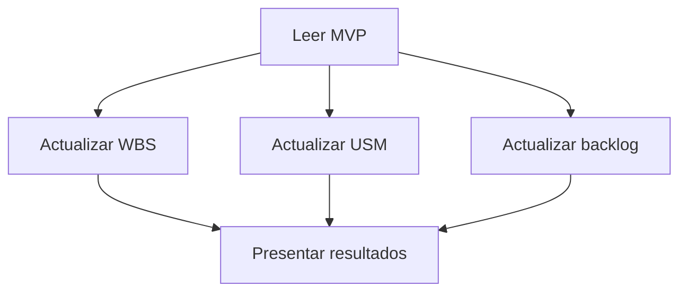

# Actualizar planificación desde el MVP

Seguir este grafo. Las rutas `docs/` y `AGENTS.md` se resuelven desde la raíz del repositorio.

## Nodos y conexiones

1. **Leer MVP:** leer `AGENTS.md` y el contenido completo de `docs/mvp.md`. Usar esa misma versión como fuente de requisitos de las tres ramas. Si cambia durante el trabajo, indicar qué versión se usó y no mezclar versiones.
2. **Actualizar WBS:** aplicar [wbs-por-entregables](../wbs-por-entregables/SKILL.md) y sus referencias. Preparar el borrador a partir del MVP.
3. **Actualizar USM:** aplicar [user-story-mapping](../user-story-mapping/SKILL.md) y sus referencias. Preparar el borrador a partir del MVP.
4. **Actualizar backlog:** aplicar [generar-backlog](../generar-backlog/SKILL.md). Preparar el borrador a partir del MVP.
5. **Presentar resultados:** reunir los tres borradores, su trazabilidad al MVP y los pendientes de cada rama. Este nodo espera el resultado o el bloqueo explícito de las tres ramas; no deriva un documento de otro ni los reconcilia automáticamente.

## Independencia y finalización

- Ninguna rama lee las salidas de las otras. Cada una verifica su contenido contra el MVP. Puede consultar su propio documento previo únicamente para conservar identificadores y formato compatibles con la fuente.
- Las ramas pueden recorrerse una tras otra; no requieren agentes separados ni ejecución simultánea. El orden de ejecución no crea una dependencia entre ellas.
- Si una rama encuentra una ambigüedad, presentarla como pendiente de esa rama y completar el trabajo posible en las restantes. No inventar reglas ni modificar el MVP.
- Por defecto, presentar borradores para revisión. Si el usuario ya autorizó expresamente guardar los resultados, guardar cada salida en `docs/wbs.md`, `docs/usm.md` y `docs/backlog.md` sin pedir nuevamente la misma autorización. Los cambios de alcance o reglas requieren una decisión explícita.
- Terminar cuando se hayan presentado las tres salidas o sus bloqueos. Este grafo no incluye un loop de corrección ni publica cambios en GitHub.
