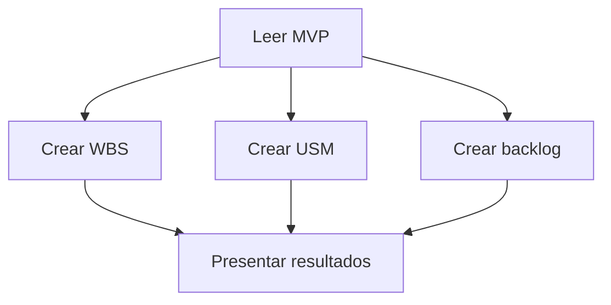

# Coordinar planificación desde el MVP

Seguir este grafo. Las rutas `docs/` y `AGENTS.md` se resuelven desde la raíz del repositorio.

## Nodos y conexiones

1. **Leer MVP:** leer `AGENTS.md` y el contenido completo de `docs/mvp.md`. Usar esa misma versión como fuente de requisitos de las tres ramas. Si cambia durante el trabajo, indicar qué versión se usó y no mezclar versiones.
2. **Crear WBS:** aplicar [crear-wbs](../crear-wbs/SKILL.md) y sus referencias. Preparar el borrador a partir del MVP.
3. **Crear USM:** aplicar [crear-usm](../crear-usm/SKILL.md) y sus referencias. Preparar el borrador a partir del MVP.
4. **Crear backlog:** aplicar [crear-backlog](../crear-backlog/SKILL.md). Preparar el borrador a partir del MVP.
5. **Presentar resultados:** reunir los tres borradores y los pendientes de cada rama. Este nodo no deriva WBS ni USM del backlog ni reconcilia automáticamente las salidas.

## Independencia y finalización

- Las ramas WBS, USM y backlog no leen las salidas de las otras. Cada una verifica su contenido contra el MVP. Pueden consultar su propio documento previo únicamente para conservar identificadores y formato compatibles con la fuente.
- Las ramas pueden recorrerse una tras otra; no requieren agentes separados ni ejecución simultánea. El orden de ejecución no crea una dependencia entre ellas.
- Si una rama encuentra una ambigüedad, presentarla como pendiente de esa rama y completar el trabajo posible en las restantes. No inventar reglas ni modificar el MVP.
- Por defecto, presentar borradores para revisión. Si el usuario ya autorizó expresamente guardar los resultados, guardar cada salida en `docs/wbs.md`, `docs/usm.md` y `docs/backlog.md` sin pedir nuevamente la misma autorización. Los cambios de alcance o reglas requieren una decisión explícita.
- Terminar cuando se hayan presentado las tres salidas o sus bloqueos. Este grafo no publica cambios en GitHub.
