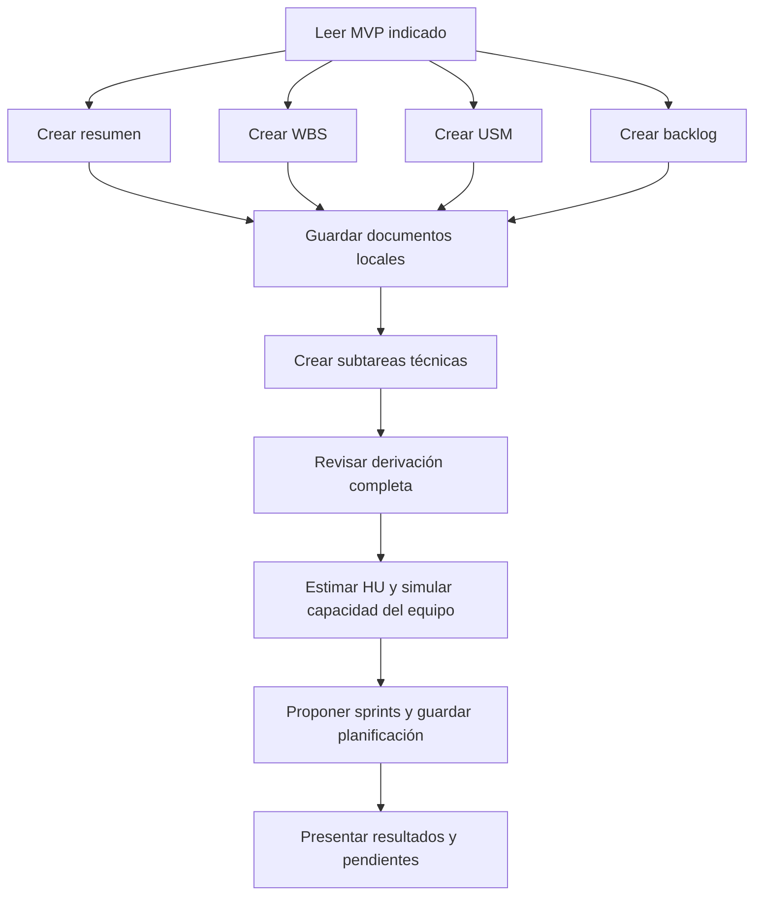

# Derivar planificación del MVP

Seguir este grafo. Las rutas `docs/` y `AGENTS.md` se resuelven desde la raíz del repositorio.

La fuente por defecto es `docs/mvp-v3.md`. Solo usar `docs/mvp-v1.md` o `docs/mvp-v2.md` cuando el usuario lo indique explícitamente para una comparación o migración. Nunca mezclar versiones.

## Nodos y conexiones

1. **Leer MVP:** leer `AGENTS.md` y el contenido completo de la versión indicada (`docs/mvp-v1.md`, `docs/mvp-v2.md` o `docs/mvp-v3.md`). Usar esa misma versión como fuente de requisitos de todas las ramas. Registrar en los documentos qué versión se usó y no mezclar versiones.
2. **Crear WBS:** aplicar [crear-wbs](../crear-wbs/SKILL.md) y sus referencias. Preparar el borrador a partir del MVP.
3. **Crear USM:** aplicar [crear-usm](../crear-usm/SKILL.md) y sus referencias. Preparar el borrador a partir del MVP.
4. **Crear backlog:** aplicar [crear-backlog](../crear-backlog/SKILL.md). Preparar las épicas e historias a partir del MVP.
5. **Crear resumen:** redactar una vista rápida del espíritu, flujo, roles, entidad central y principios del MVP. Guardar en `docs/mvp-resumido.md`. No incluir secciones de alcance incluido ni de exclusiones; declarar siempre que es un artefacto derivado, nunca fuente de verdad.
6. **Guardar documentos locales:** cuando el usuario solicite derivar el plan completo, guardar los resultados aprobados o solicitados en `docs/wbs.md`, `docs/usm.md` y `docs/backlog.md`.
7. **Crear subtareas técnicas:** después de disponer del backlog local, aplicar [create-subtereas](../create-subtereas/SKILL.md) para descomponer las historias aprobadas en subtareas Backend/API REST y Frontend. Guardar el resultado local en `docs/subtareas.md`.
8. **Revisar derivación completa:** comprobar la trazabilidad al MVP, los criterios de aceptación y las dependencias de las HU y subtareas. Incorporar el refinamiento solicitado antes de estimar; señalar ambigüedades sin inventar reglas.
9. **Estimar HU y simular capacidad del equipo:** aplicar [crear-sprints](../crear-sprints/SKILL.md) al backlog revisado y sus subtareas. Reutilizar los datos del equipo y decisiones de la conversación; preguntar lo que falte o declarar supuestos si se solicitó una simulación. Separar capacidad horaria, puntos estimados y velocidad observada o hipotética. Conservar estimaciones anteriores válidas salvo pedido de reestimación. Los 6 integrantes, 15 horas semanales y 20 puntos del ejemplo no son valores universales.
10. **Proponer sprints y guardar planificación:** continuar con `crear-sprints` para agrupar HU completas según objetivos, dependencias y capacidad. Guardar en `docs/sprints.md` la versión del MVP, fecha, supuestos, capacidad horaria, estimaciones por HU, velocidad de referencia, distribución y trabajo pendiente. Si hay incertidumbres, identificar la propuesta como provisional. No asignar fechas arbitrarias ni reducir puntos para forzar una entrega.
11. **Presentar resultados y pendientes:** presentar la versión utilizada, documentos generados, capacidad, total de puntos, sprints propuestos, diferencias respecto de la planificación anterior y decisiones pendientes.

## Independencia y finalización

- Las ramas WBS, USM y backlog no leen las salidas de las otras. Cada una verifica su contenido contra el MVP. Pueden consultar su propio documento previo únicamente para conservar identificadores y formato compatibles con la fuente.
- Usar una numeración WBS única y jerárquica en los artefactos derivados: épicas `[1.0.0]`, `[2.0.0]`; historias `[1.1.0]`, `[1.2.0]`; subtareas `[1.1.1]`, `[1.1.2]`. Conservar `[Backend]` y `[Frontend]` en los títulos de subtareas. No introducir nuevamente prefijos `E1` o `HUxx` en títulos visibles.
- Las ramas pueden recorrerse una tras otra; no requieren agentes separados ni ejecución simultánea. El orden de ejecución no crea una dependencia entre ellas.
- La etapa final de sprints sí depende del backlog revisado, sus subtareas y los datos del equipo. Usa estos documentos para estimar y organizar trabajo, manteniendo el MVP como fuente de requisitos.
- Si el pedido se limita a un artefacto (por ejemplo, actualizar solo la WBS), no ejecutar la etapa de sprints. En una actualización completa, revisar el impacto en estimaciones y distribución existentes; no reemplazarlas sin analizar qué cambió.
- Si una rama encuentra una ambigüedad, presentarla como pendiente de esa rama y completar el trabajo posible en las restantes. No inventar reglas ni modificar el MVP.
- “Derivar todo”, “preparar la planificación” o “actualizar la documentación” permite dejar los resultados en `docs/` cuando el contexto lo indique.
- Los cambios de alcance o reglas requieren una decisión explícita y deben reflejarse primero en la versión del MVP utilizada.
- Terminar cuando se hayan guardado y presentado el resumen, WBS, USM, backlog, subtareas y propuesta de sprints, o cuando se identifique qué parte queda pendiente y por qué. Si faltan datos para comprometer sprints, completar los documentos y estimaciones posibles y dejar la distribución pendiente o como simulación explícita.
- Este grafo produce documentación local; no publica cambios en GitHub ni crea o modifica issues o sprints en Jira. La aplicación externa requiere que el usuario la solicite y se realiza por separado.
