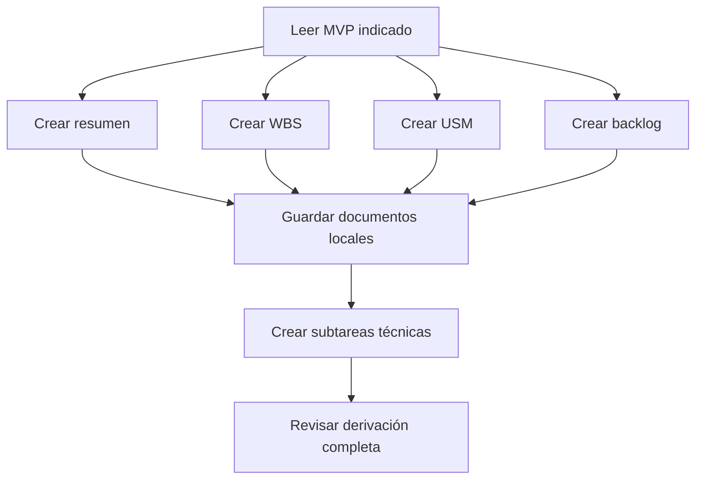

# Derivar planificación del MVP

Seguir este grafo. Las rutas `docs/` y `AGENTS.md` se resuelven desde la raíz del repositorio.

La fuente por defecto es `docs/mvp-v3.md`. Solo usar `docs/mvp-v1.md` o `docs/mvp-v2.md` cuando el usuario lo indique explícitamente para una comparación o migración. Nunca mezclar versiones.

## Nodos y conexiones

1. **Leer MVP:** leer `AGENTS.md` y el contenido completo de la versión indicada (`docs/mvp-v1.md`, `docs/mvp-v2.md` o `docs/mvp-v3.md`). Usar esa misma versión como fuente de requisitos de todas las ramas. Registrar en los documentos qué versión se usó y no mezclar versiones.
2. **Crear WBS:** aplicar [crear-wbs](../crear-wbs/SKILL.md) y sus referencias. Preparar el borrador a partir del MVP.
3. **Crear USM:** aplicar [crear-usm](../crear-usm/SKILL.md) y sus referencias. Preparar el borrador a partir del MVP.
4. **Crear backlog:** aplicar [crear-backlog](../crear-backlog/SKILL.md). Preparar las épicas e historias a partir del MVP.
5. **Crear resumen:** redactar una vista rápida del espíritu, flujo, roles, entidad central y principios del MVP. Guardar en `docs/mvp-resumido.md`. No incluir secciones de alcance incluido ni de exclusiones; declarar siempre que es un artefacto derivado, nunca fuente de verdad.
6. **Guardar documentos locales:** cuando el usuario solicite derivar el plan completo, guardar los resultados aprobados o solicitados en `docs/wbs.md`, `docs/usm.md` y `docs/backlog.md`.
7. **Crear subtareas técnicas:** después de disponer del backlog local, aplicar [create-subtereas](../create-subtereas/SKILL.md) para descomponer las historias aprobadas en subtareas Backend/API REST y Frontend. Guardar el resultado local en `docs/subtareas.md`.
8. **Revisar derivación completa:** presentar la versión del MVP utilizada, los documentos generados, los pendientes y cualquier diferencia con los artefactos anteriores.

## Independencia y finalización

- Las ramas WBS, USM y backlog no leen las salidas de las otras. Cada una verifica su contenido contra el MVP. Pueden consultar su propio documento previo únicamente para conservar identificadores y formato compatibles con la fuente.
- Las ramas pueden recorrerse una tras otra; no requieren agentes separados ni ejecución simultánea. El orden de ejecución no crea una dependencia entre ellas.
- Si una rama encuentra una ambigüedad, presentarla como pendiente de esa rama y completar el trabajo posible en las restantes. No inventar reglas ni modificar el MVP.
- “Derivar todo”, “preparar la planificación” o “actualizar la documentación” permite dejar los resultados en `docs/` cuando el contexto lo indique.
- Los cambios de alcance o reglas requieren una decisión explícita y deben reflejarse primero en la versión del MVP utilizada.
- Terminar cuando se hayan guardado y presentado el resumen, WBS, USM, backlog y subtareas, o cuando se informe un bloqueo. Este grafo no publica cambios en GitHub.
